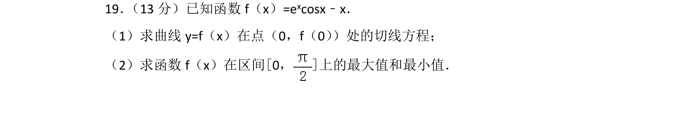
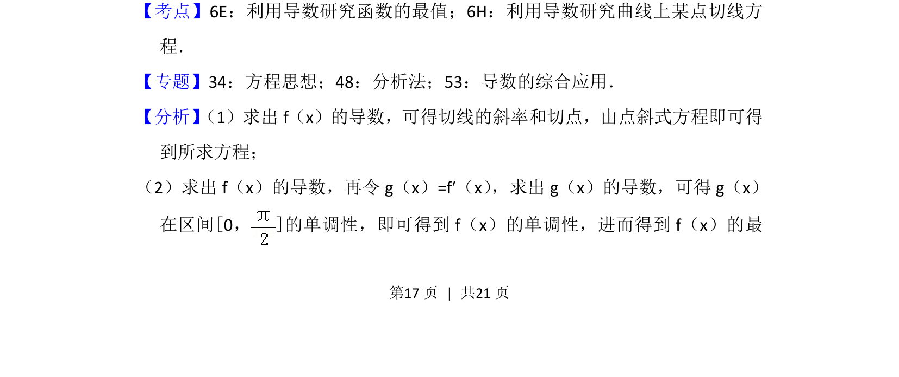
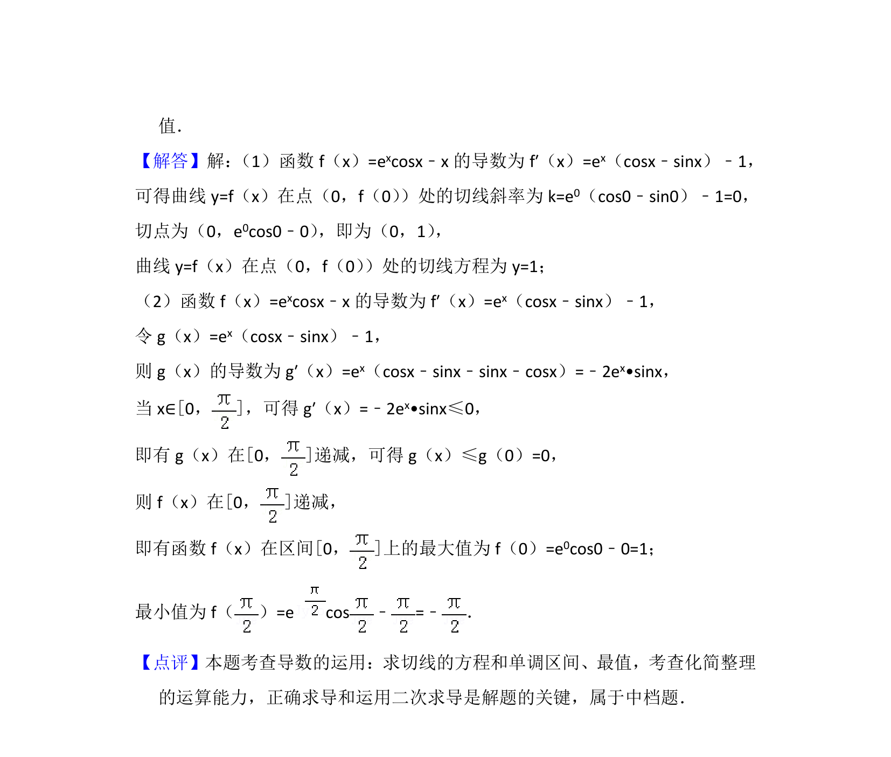

## 题面

## 摘要

含指数与余弦的函数，求切线方程及闭区间上的最值。

## 关联考点

- [[706-利用导数研究函数的最值|利用导数研究函数的最值]]
- [[710-利用导数研究曲线上某点切线方程|利用导数研究曲线上某点切线方程]]

## 答案与解析

> 📄 原 PDF 第 17 页：`素材/真题/北京/2008-2024·（北京）数学高考真题/2017年高考数学试卷（理）（北京）（解析卷）.pdf`

<!-- 题干文本-start -->
## 题干文本
19． （13分）已知函数f（x）=excosx﹣x．
（1）求曲线y=f（x）在点（0，f（0） ）处的切线方程；
（2）求函数f（x）在区间[0，]上的最大值和最小值．
<!-- 题干文本-end -->

<!-- 解析文本-start -->
## 解析文本
【考点】6E：利用导数研究函数的最值；6H：利用导数研究曲线上某点切线方
程．菁优网版权所有
【专题】34：方程思想；48：分析法；53：导数的综合应用．
【分析】 （1）求出f（x）的导数，可得切线的斜率和切点，由点斜式方程即可得
到所求方程；
（2）求出f（x）的导数，再令g（x）=f′（x） ，求出g（x）的导数，可得g（x）
在区间[0，]的单调性，即可得到f（x）的单调性，进而得到f（x）的最
<!-- 解析文本-end -->
