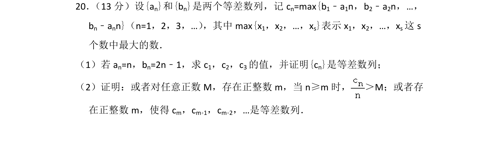
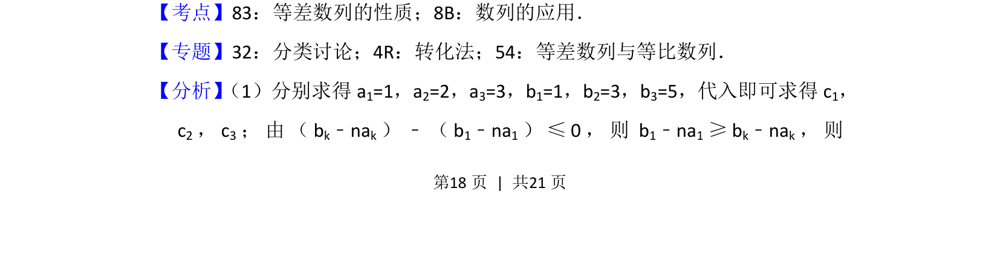
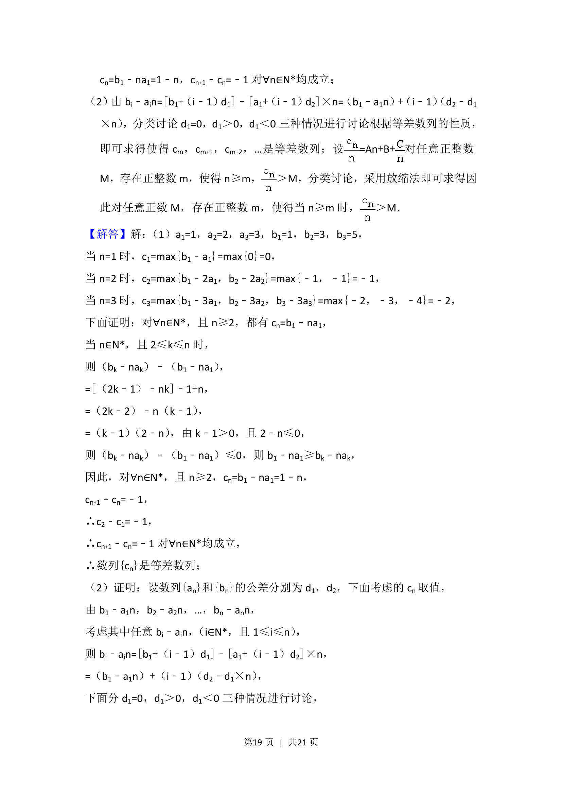
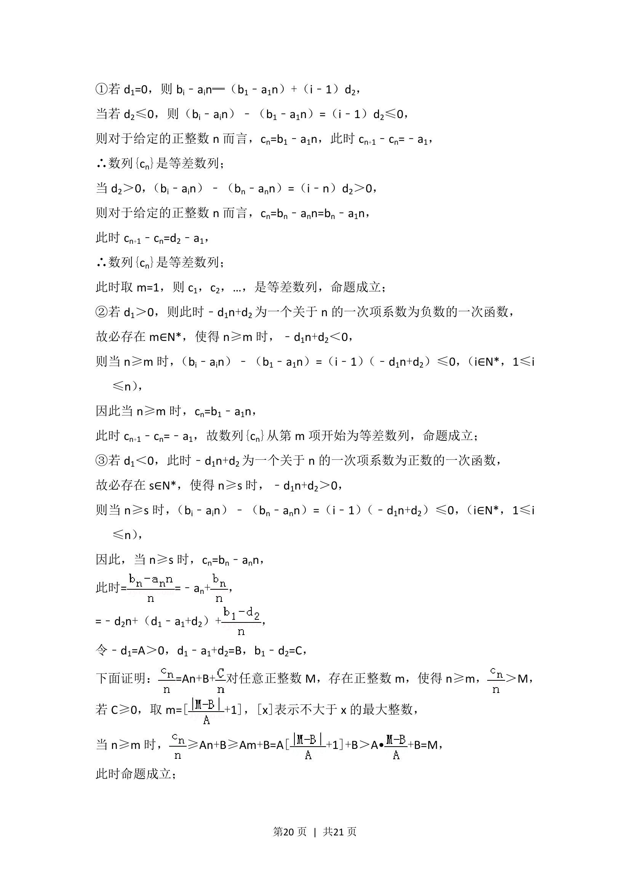
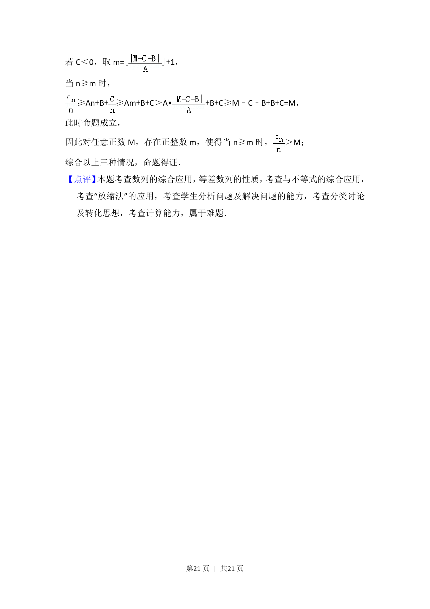

## 题面

## 摘要

本题考查等差数列的性质及新定义数列的证明，涉及分类讨论与转化思想。

## 关联考点

- [[1061-等差数列的性质|等差数列的性质]]
- [[459-数列的应用|数列的应用]]
- [[424-参数分类讨论|分类讨论]]
- [[转化法]]

## 答案与解析

> 📄 原 PDF 第 18 页：`素材/真题/北京/2008-2024·（北京）数学高考真题/2017年高考数学试卷（理）（北京）（解析卷）.pdf`
