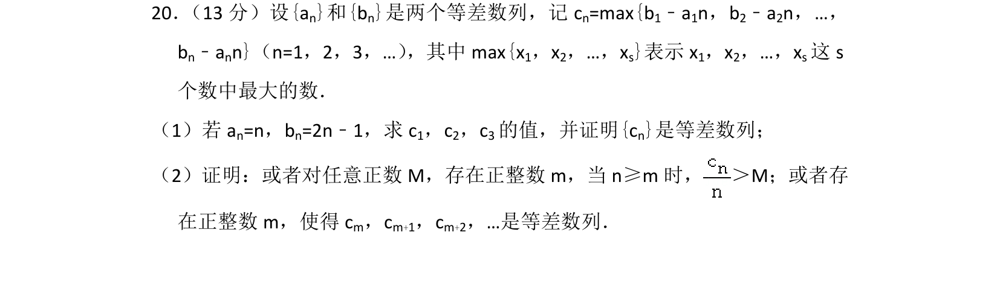
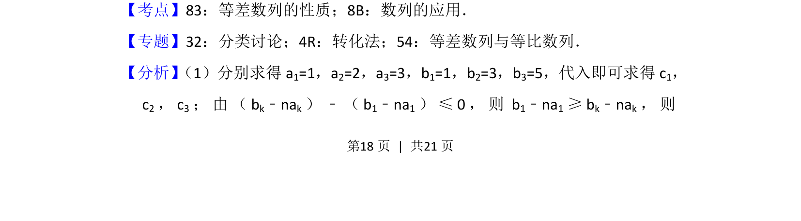
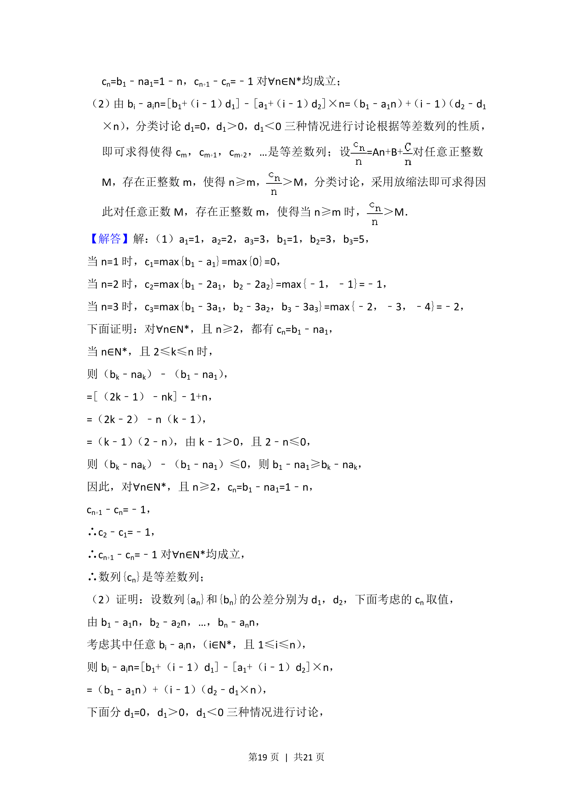
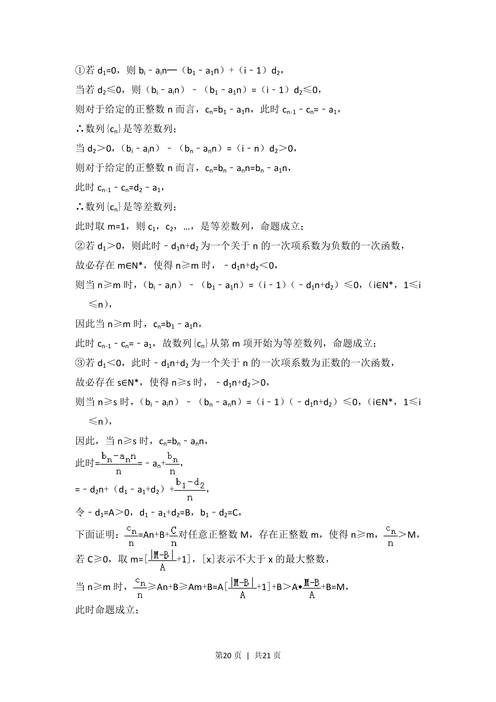
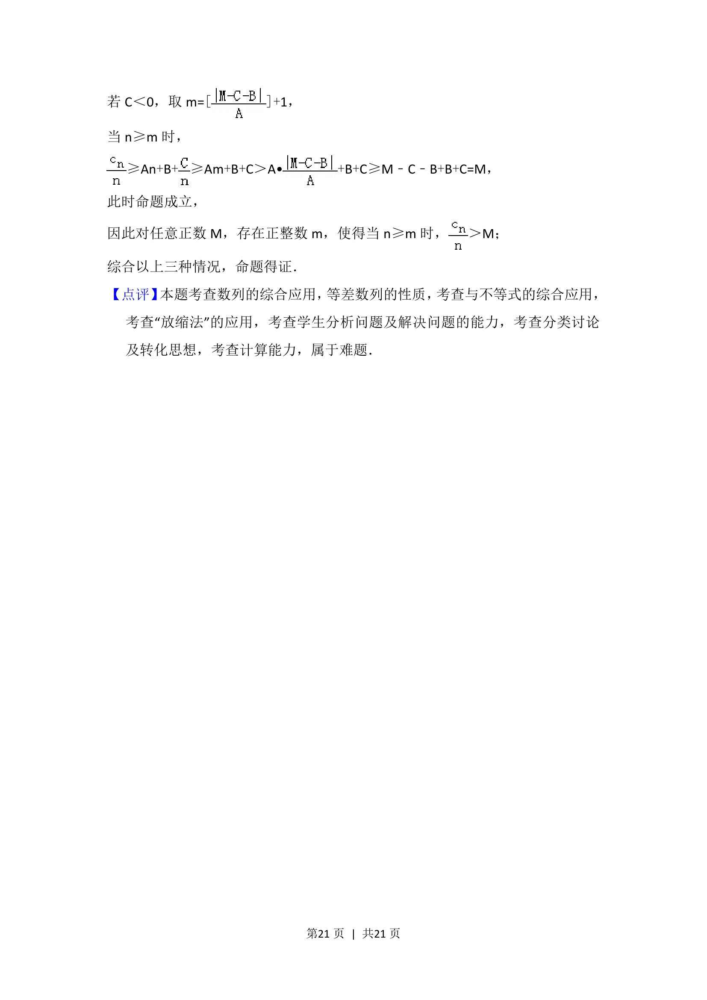

## 题面

## 摘要

本题考查等差数列的性质及新定义数列的证明，涉及分类讨论与转化思想。

## 关联考点

- [[412-等差数列性质|等差数列的性质]]
- [[459-数列的应用|数列的应用]]
- [[424-参数分类讨论|分类讨论]]
- [[转化法]]

## 答案与解析

> 📄 原 PDF 第 18 页：`素材/真题/北京/2008-2024·（北京）数学高考真题/2017年高考数学试卷（理）（北京）（解析卷）.pdf`

<!-- 题干文本-start -->
## 题干文本
20． （13分）设{an}和{bn}是两个等差数列，记c n=max{b1﹣a1n，b2﹣a2n，…，
bn﹣ann}（n=1，2，3，…） ，其中max{x1，x2，…，xs}表示x 1，x2，…，xs这s
个数中最大的数．
（1）若a n=n，bn=2n﹣1，求c 1，c2，c3的值，并证明{cn}是等差数列；
（2）证明：或者对任意正数M，存在正整数m，当n≥m时， ＞M；或者存
在正整数m，使得c m，cm+1，cm+2，…是等差数列．
<!-- 题干文本-end -->

<!-- 解析文本-start -->
## 解析文本
【考点】83：等差数列的性质；8B：数列的应用．菁优网版权所有
【专题】32：分类讨论；4R：转化法；54：等差数列与等比数列．
【分析】 （1）分别求得a1=1，a2=2，a3=3，b1=1，b2=3，b3=5，代入即可求得c 1，
c2，c 3；由（b k﹣nak）﹣（b 1﹣na1）≤0，则b 1﹣na1≥b k﹣nak，则
<!-- 解析文本-end -->
