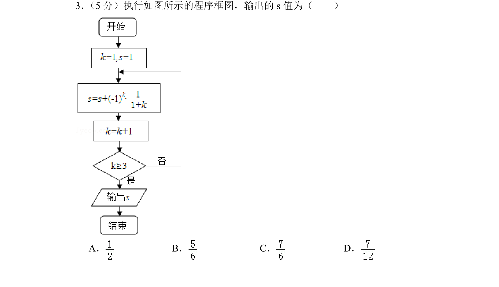
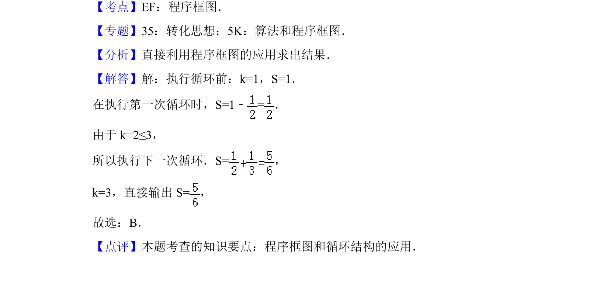

## 题面

## 摘要

执行程序框图，通过循环结构计算输出S值

## 关联考点

- [[1042-程序框图|程序框图]]
- [[870-循环结构|循环结构]]
- [[1075-算法|算法]]

## 答案与解析

> 📄 原 PDF 第 2 页：`素材/真题/北京/2008-2024·（北京）数学高考真题/2018年高考数学试卷（文）（北京）（解析卷）.pdf`

<!-- 题干文本-start -->
## 题干文本
3． （5分）执行如图所示的程序框图，输出的s值为（　　）
A．B．C．D．
<!-- 题干文本-end -->

<!-- 解析文本-start -->
## 解析文本
【考点】EF：程序框图．菁优网版权所有
【专题】35：转化思想；5K：算法和程序框图．
【分析】直接利用程序框图的应用求出结果．
【解答】解：执行循环前：k=1，S=1．
在执行第一次循环时，S=1﹣=．
由于k=2≤3，
所以执行下一次循环．S=，
k=3，直接输出S=，
故选：B．
【点评】本题考查的知识要点：程序框图和循环结构的应用．
<!-- 解析文本-end -->
