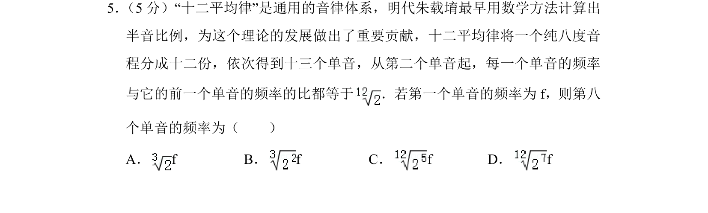
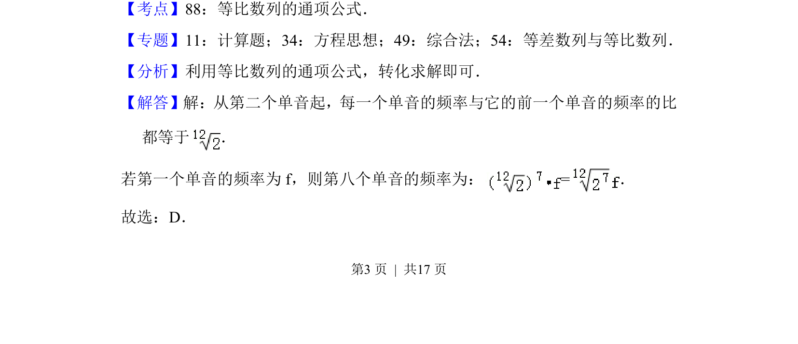

## 题面

## 摘要

本题以十二平均律为背景，考查等比数列的通项公式应用。

## 关联考点

- [[1068-等比数列的定义与通项公式|等比数列]]
- [[数列通项]]
- [[1378-应用题|应用题]]

## 答案与解析

> 📄 原 PDF 第 3 页：`素材/真题/北京/2008-2024·（北京）数学高考真题/2018年高考数学试卷（文）（北京）（解析卷）.pdf`
