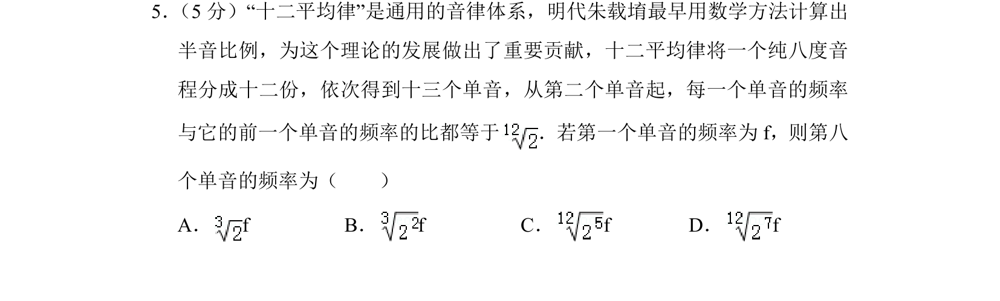
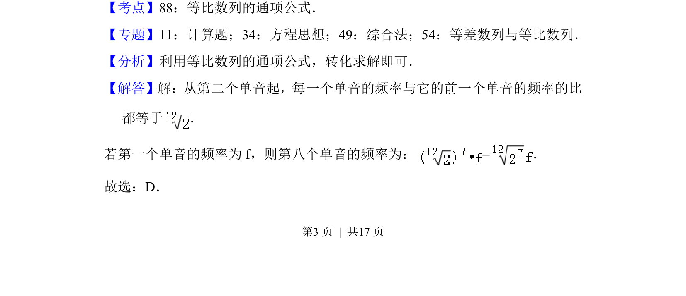

## 题面

## 摘要

本题以十二平均律为背景，考查等比数列的通项公式应用。

## 关联考点

- [[1067-等比数列的定义与通项公式|等比数列]]
- [[数列通项]]
- [[1378-应用题|应用题]]

## 答案与解析

> 📄 原 PDF 第 3 页：`素材/真题/北京/2008-2024·（北京）数学高考真题/2018年高考数学试卷（文）（北京）（解析卷）.pdf`

<!-- 题干文本-start -->
## 题干文本
5． （5分）“十二平均律”是通用的音律体系，明代朱载堉最早用数学方法计算出
半音比例，为这个理论的发展做出了重要贡献，十二平均律将一个纯八度音
程分成十二份，依次得到十三个单音，从第二个单音起，每一个单音的频率
与它的前一个单音的频率的比都等于 ．若第一个单音的频率为f，则第八
个单音的频率为（　　）
A．f B．f C．f D．f
<!-- 题干文本-end -->

<!-- 解析文本-start -->
## 解析文本
【考点】88：等比数列的通项公式．菁优网版权所有
【专题】11：计算题；34：方程思想；49：综合法；54：等差数列与等比数列．
【分析】利用等比数列的通项公式，转化求解即可．
【解答】解：从第二个单音起，每一个单音的频率与它的前一个单音的频率的比
都等于 ．
若第一个单音的频率为f，则第八个单音的频率为：=．
故选：D．
<!-- 解析文本-end -->
