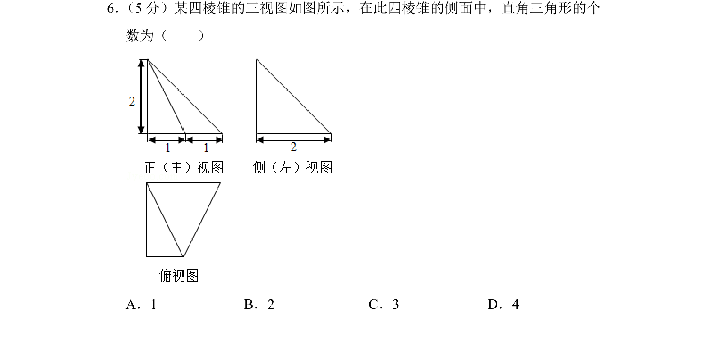
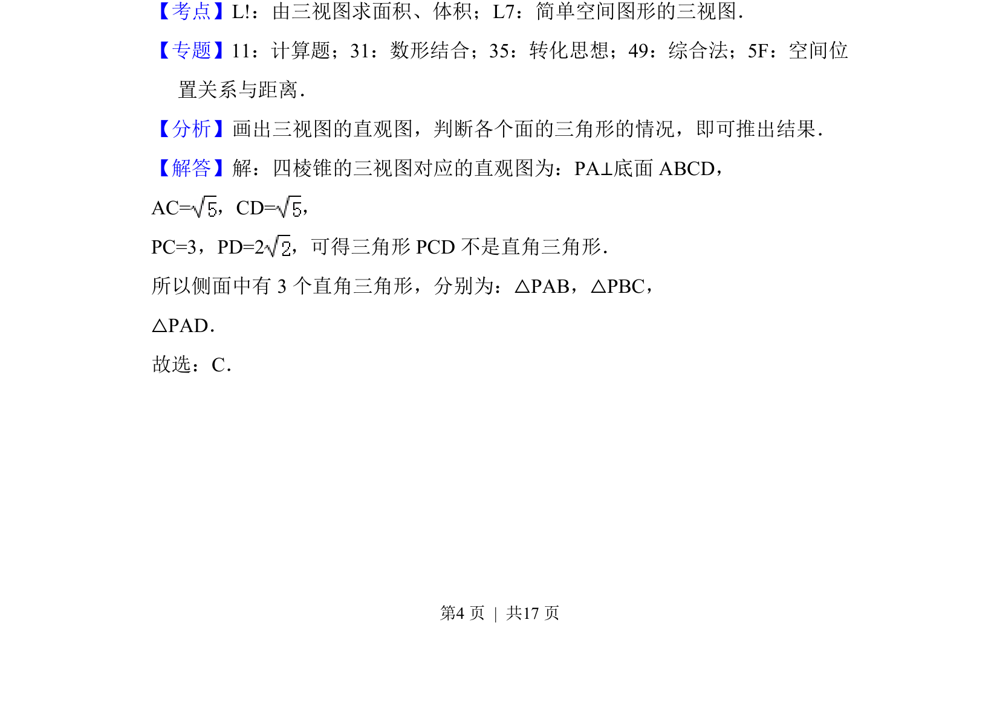
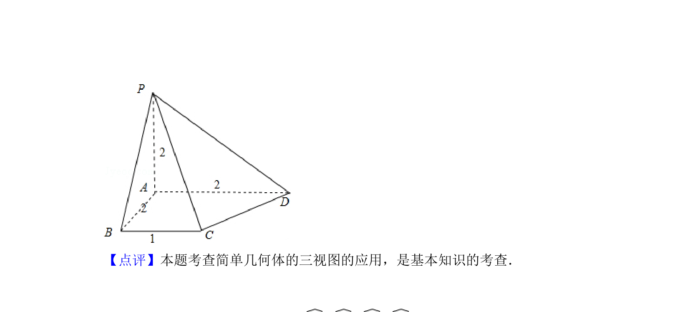

## 题面

## 摘要

四棱锥三视图还原直观图，判断侧面直角三角形个数

## 关联考点

- [[1199-由三视图求面积|由三视图求面积]]
- [[066-体积|体积]]
- [[582-简单空间图形的三视图|简单空间图形的三视图]]

## 答案与解析

> 📄 原 PDF 第 4 页：`素材/真题/北京/2008-2024·（北京）数学高考真题/2018年高考数学试卷（文）（北京）（解析卷）.pdf`
