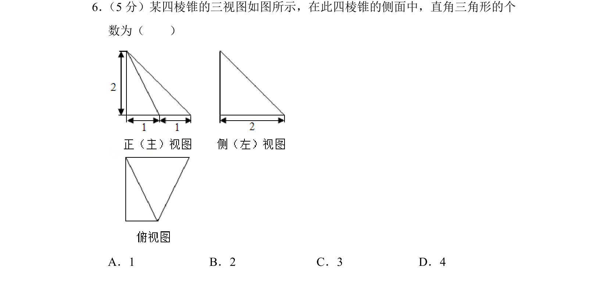
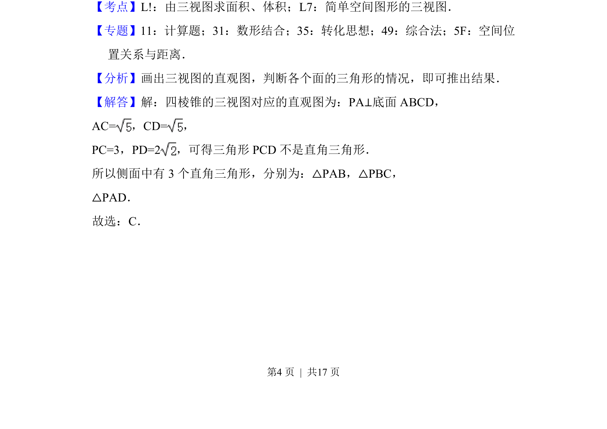
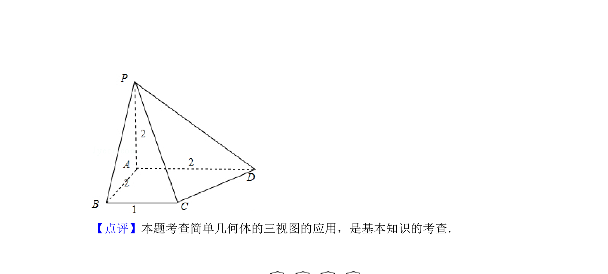

## 题面

## 摘要

四棱锥三视图还原直观图，判断侧面直角三角形个数

## 关联考点

- [[1198-由三视图求面积|由三视图求面积]]
- [[066-体积|体积]]
- [[582-简单空间图形的三视图|简单空间图形的三视图]]

## 答案与解析

> 📄 原 PDF 第 4 页：`素材/真题/北京/2008-2024·（北京）数学高考真题/2018年高考数学试卷（文）（北京）（解析卷）.pdf`

<!-- 题干文本-start -->
## 题干文本
6． （5分）某四棱锥的三视图如图所示，在此四棱锥的侧面中，直角三角形的个
数为（　　）
A．1 B．2 C．3 D．4
<!-- 题干文本-end -->

<!-- 解析文本-start -->
## 解析文本
【考点】L!：由三视图求面积、体积；L7：简单空间图形的三视图．菁优网版权所有
【专题】11：计算题；31：数形结合；35：转化思想；49：综合法；5F：空间位
置关系与距离．
【分析】画出三视图的直观图，判断各个面的三角形的情况，即可推出结果．
【解答】解：四棱锥的三视图对应的直观图为：PA⊥底面ABCD，
AC=，CD=，
PC=3，PD=2，可得三角形PCD不是直角三角形．
所以侧面中有3个直角三角形，分别为：△PAB，△PBC，
△PAD．
故选：C．
<!-- 解析文本-end -->
