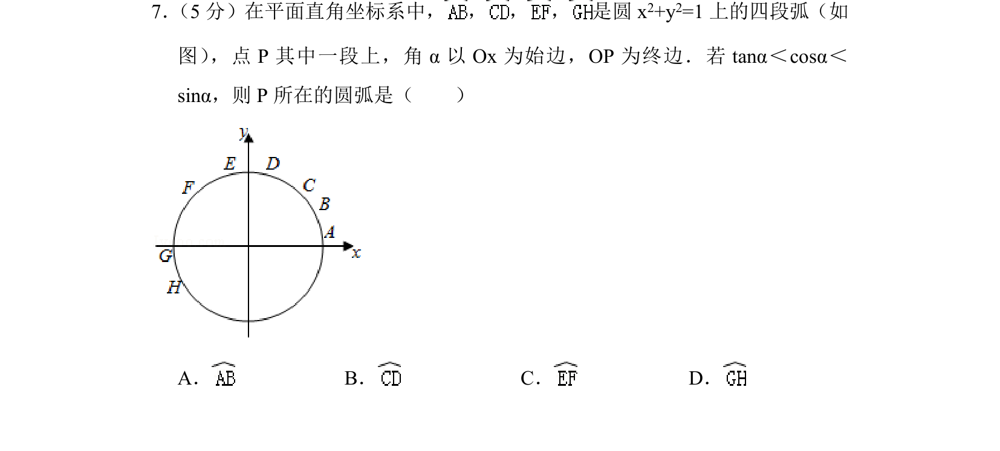
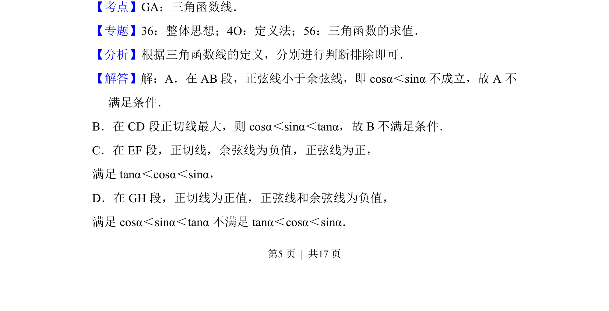
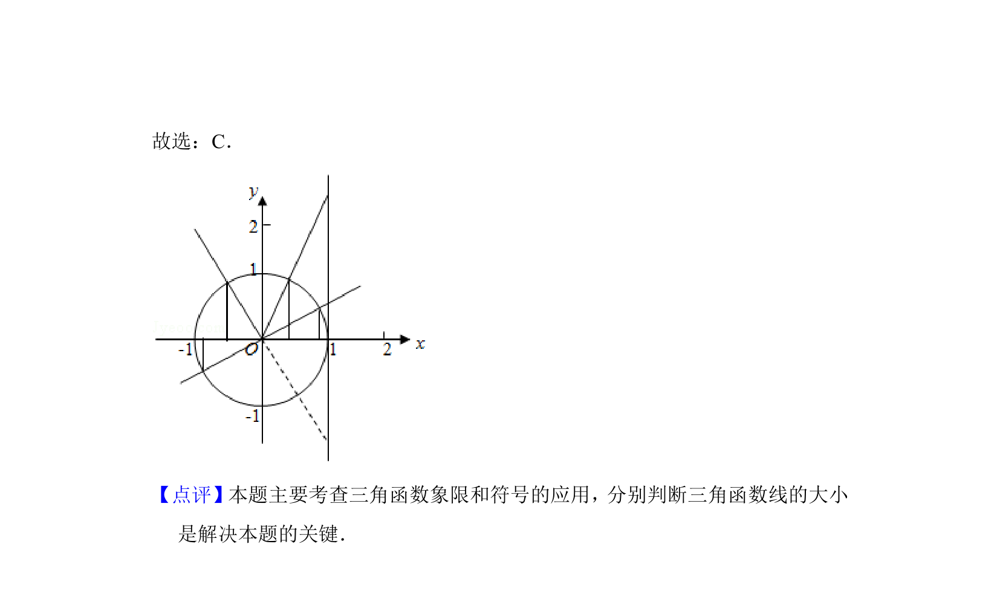

## 题面

## 摘要

本题通过单位圆上的弧段与三角函数线，比较角α的正切、余弦、正弦值的大小关系，判断点P所在圆弧。

## 关联考点

- [[271-三角函数线|三角函数线]]
- [[291-单位圆|单位圆]]
- [[三角函数值比较]]

## 答案与解析

> 📄 原 PDF 第 5 页：`素材/真题/北京/2008-2024·（北京）数学高考真题/2018年高考数学试卷（文）（北京）（解析卷）.pdf`
