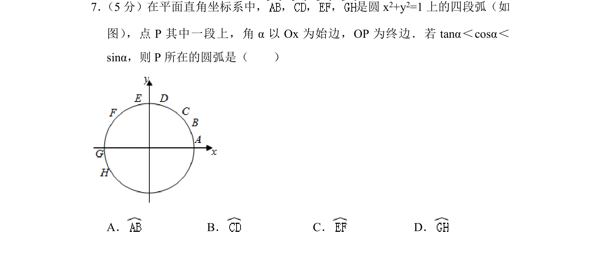
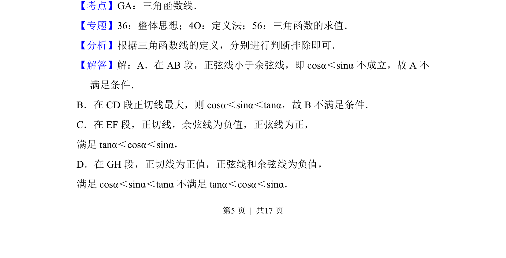
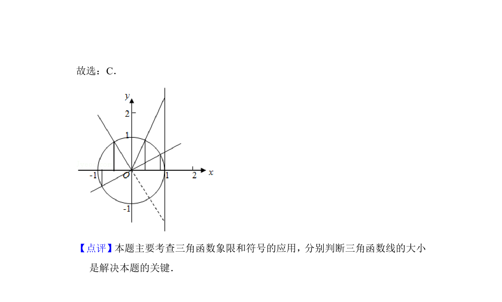

## 题面

## 摘要

本题通过单位圆上的弧段与三角函数线，比较角α的正切、余弦、正弦值的大小关系，判断点P所在圆弧。

## 关联考点

- [[271-三角函数线|三角函数线]]
- [[291-单位圆|单位圆]]
- [[三角函数值比较]]

## 答案与解析

> 📄 原 PDF 第 5 页：`素材/真题/北京/2008-2024·（北京）数学高考真题/2018年高考数学试卷（文）（北京）（解析卷）.pdf`

<!-- 题干文本-start -->
## 题干文本
7． （5分）在平面直角坐标系中， ， ， ， 是圆x 2+y2=1上的四段弧（如
图） ，点P其中一段上，角α以Ox为始边，OP为终边．若tanα＜cosα＜
sinα，则P所在的圆弧是（　　）
A．B．C．D．
<!-- 题干文本-end -->

<!-- 解析文本-start -->
## 解析文本
【考点】GA：三角函数线．菁优网版权所有
【专题】36：整体思想；4O：定义法；56：三角函数的求值．
【分析】根据三角函数线的定义，分别进行判断排除即可．
【解答】解：A．在AB段，正弦线小于余弦线，即cosα＜sinα不成立，故A不
满足条件．
B．在CD段正切线最大，则cosα＜sinα＜tanα，故B不满足条件．
C．在EF段，正切线，余弦线为负值，正弦线为正，
满足tanα＜cosα＜sinα，
D．在GH段，正切线为正值，正弦线和余弦线为负值，
满足cosα＜sinα＜tanα不满足tanα＜cosα＜sinα．
<!-- 解析文本-end -->
