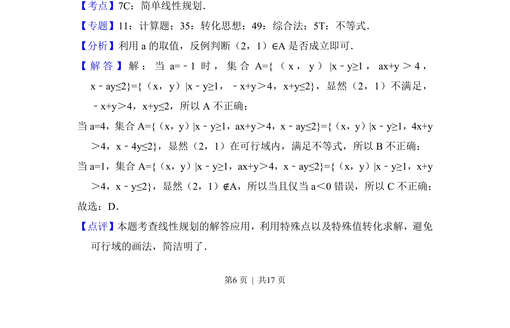

## 题面

## 摘要

本题通过判断点是否在集合内，考查二元一次不等式组表示的平面区域与简单线性规划的应用。

## 关联考点

- [[1075-简单线性规划|简单线性规划]]
- [[042-集合|集合]]
- [[083-不等式|不等式]]
- [[1117-赋值|特殊值法]]

## 答案与解析

> 📄 原 PDF 第 6 页：`素材/真题/北京/2008-2024·（北京）数学高考真题/2018年高考数学试卷（文）（北京）（解析卷）.pdf`
