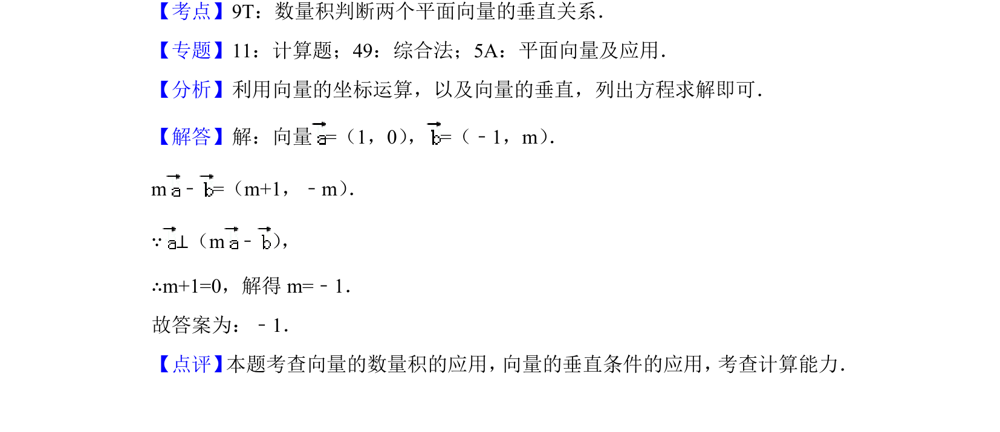

## 题面

## 摘要

本题考查平面向量的坐标运算及利用数量积判断垂直关系，通过解方程求参数m。

## 关联考点

- [[数量积判断向量垂直]]
- [[541-向量坐标运算|向量的坐标运算]]

## 答案与解析

> 📄 原 PDF 第 7 页：`素材/真题/北京/2008-2024·（北京）数学高考真题/2018年高考数学试卷（文）（北京）（解析卷）.pdf`

<!-- 题干文本-start -->
## 题干文本
9． （5分）设向量=（1，0） ，=（﹣1，m） ．若⊥（m﹣） ，则m=　﹣1　．
<!-- 题干文本-end -->

<!-- 解析文本-start -->
## 解析文本
【考点】9T：数量积判断两个平面向量的垂直关系．菁优网版权所有
【专题】11：计算题；49：综合法；5A：平面向量及应用．
【分析】利用向量的坐标运算，以及向量的垂直，列出方程求解即可．
【解答】解：向量=（1，0） ，=（﹣1，m） ．
m﹣=（m+1，﹣m） ．
∵ ⊥（m﹣） ，
∴m+1=0，解得m=﹣1．
故答案为：﹣1．
【点评】 本题考查向量的数量积的应用， 向量的垂直条件的应用， 考查计算能力．
<!-- 解析文本-end -->
