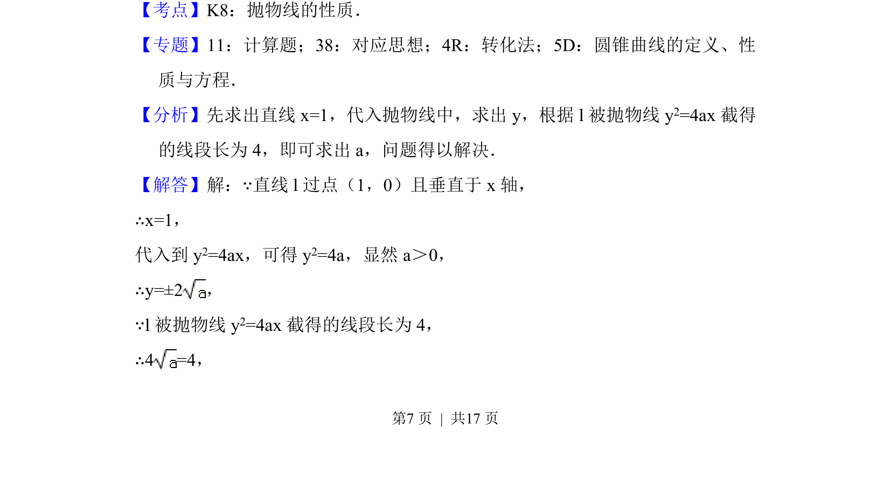
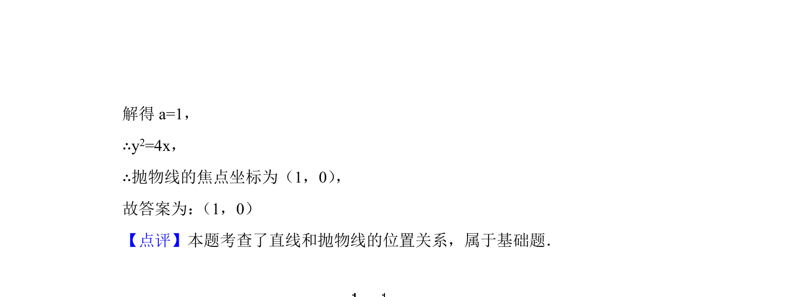

## 题面

## 摘要

已知直线垂直于x轴并与抛物线相交，利用弦长求参数，进而确定焦点坐标。

## 关联考点

- [[879-抛物线的性质|抛物线的性质]]
- [[1008-直线与圆锥曲线相交|直线与圆锥曲线相交]]
- [[869-弦长计算|弦长计算]]

## 答案与解析

> 📄 原 PDF 第 7 页：`素材/真题/北京/2008-2024·（北京）数学高考真题/2018年高考数学试卷（文）（北京）（解析卷）.pdf`
