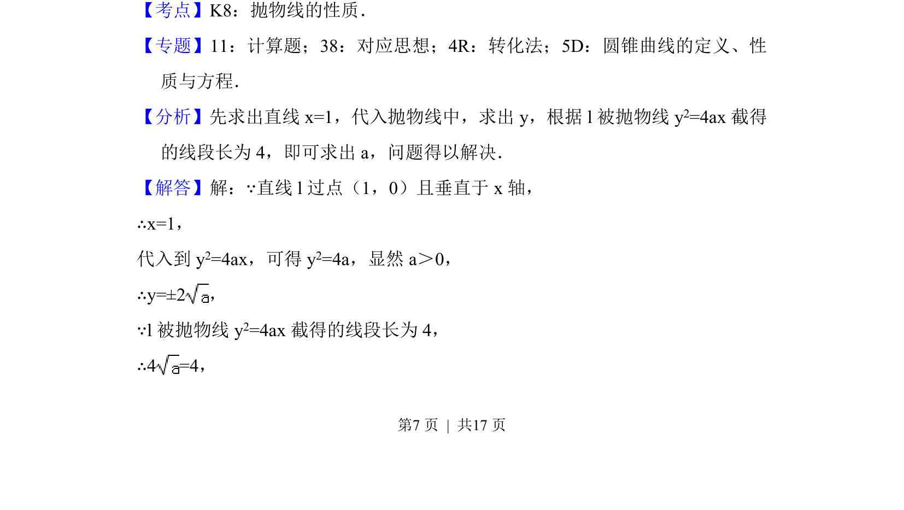
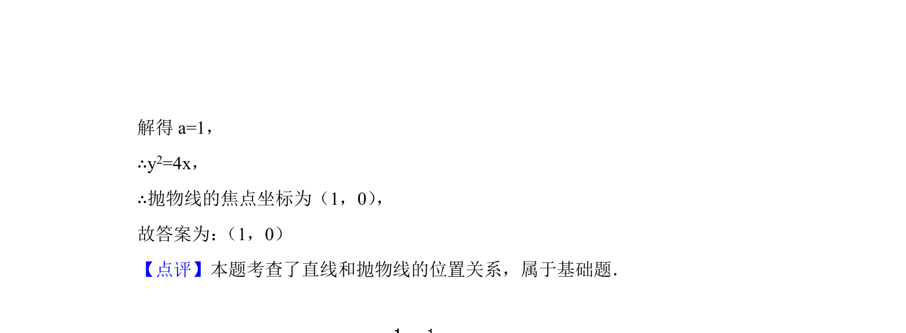

## 题面

## 摘要

已知直线垂直于x轴并与抛物线相交，利用弦长求参数，进而确定焦点坐标。

## 关联考点

- [[879-抛物线的性质|抛物线的性质]]
- [[1008-直线与圆锥曲线相交|直线与圆锥曲线相交]]
- [[869-弦长计算|弦长计算]]

## 答案与解析

> 📄 原 PDF 第 7 页：`素材/真题/北京/2008-2024·（北京）数学高考真题/2018年高考数学试卷（文）（北京）（解析卷）.pdf`

<!-- 题干文本-start -->
## 题干文本
10． （5分）已知直线l过点（1，0）且垂直于x轴．若l被抛物线y 2=4ax截得
的线段长为4，则抛物线的焦点坐标为　（1，0）　．
<!-- 题干文本-end -->

<!-- 解析文本-start -->
## 解析文本
【考点】K8：抛物线的性质．菁优网版权所有
【专题】11：计算题；38：对应思想；4R：转化法；5D：圆锥曲线的定义、性
质与方程．
【分析】先求出直线x=1，代入抛物线中，求出y，根据l被抛物线y 2=4ax截得
的线段长为4，即可求出a，问题得以解决．
【解答】解：∵直线l过点（1，0）且垂直于x轴，
∴x=1，
代入到y 2=4ax，可得y 2=4a，显然a＞0，
∴y=±2，
∵l被抛物线y 2=4ax截得的线段长为4，
∴4 =4，
<!-- 解析文本-end -->
