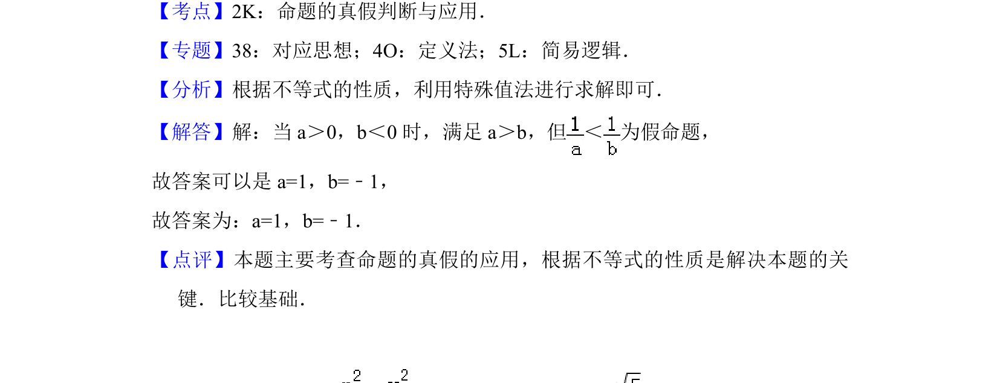

## 题面

## 摘要

通过举反例说明不等关系命题为假，考查命题真假判断与不等式性质。

## 关联考点

- [[765-命题真假判断|命题真假判断]]
- [[117-不等式性质|不等式性质]]
- [[737-反例法|反例法]]

## 答案与解析

> 📄 原 PDF 第 8 页：`素材/真题/北京/2008-2024·（北京）数学高考真题/2018年高考数学试卷（文）（北京）（解析卷）.pdf`
