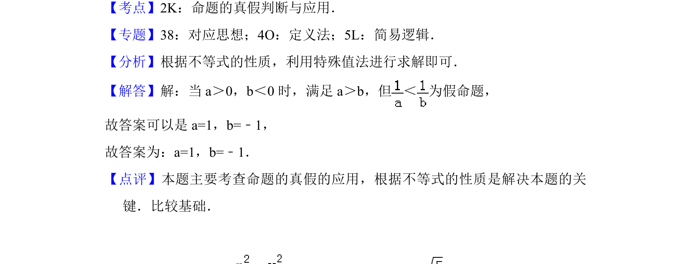

## 题面

## 摘要

通过举反例说明不等关系命题为假，考查命题真假判断与不等式性质。

## 关联考点

- [[765-命题真假判断|命题真假判断]]
- [[117-不等式性质|不等式性质]]
- [[737-反例法|反例法]]

## 答案与解析

> 📄 原 PDF 第 8 页：`素材/真题/北京/2008-2024·（北京）数学高考真题/2018年高考数学试卷（文）（北京）（解析卷）.pdf`

<!-- 题干文本-start -->
## 题干文本
11． （5分）能说明“若a＞b，则 ＜”为假命题的一组a，b的值依次为　a=1，
b=﹣1　．
<!-- 题干文本-end -->

<!-- 解析文本-start -->
## 解析文本
【考点】2K：命题的真假判断与应用．菁优网版权所有
【专题】38：对应思想；4O：定义法；5L：简易逻辑．
【分析】根据不等式的性质，利用特殊值法进行求解即可．
【解答】解：当a＞0，b＜0时，满足a＞b，但 ＜ 为假命题，
故答案可以是a=1，b=﹣1，
故答案为：a=1，b=﹣1．
【点评】本题主要考查命题的真假的应用，根据不等式的性质是解决本题的关
键．比较基础．
<!-- 解析文本-end -->
