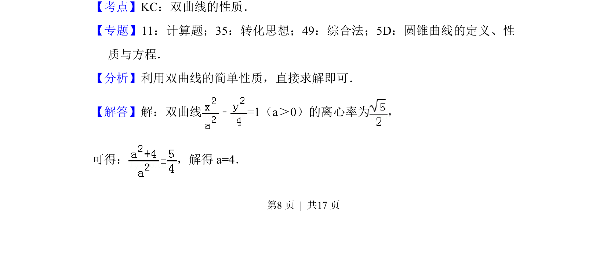

## 题面

## 摘要

求双曲线参数a的值，利用离心率公式建立方程求解。

## 关联考点

- [[731-双曲线的性质|双曲线的性质]]
- [[391-椭圆离心率|离心率]]
- [[061-方程|方程求解]]

## 答案与解析

> 📄 原 PDF 第 8 页：`素材/真题/北京/2008-2024·（北京）数学高考真题/2018年高考数学试卷（文）（北京）（解析卷）.pdf`
