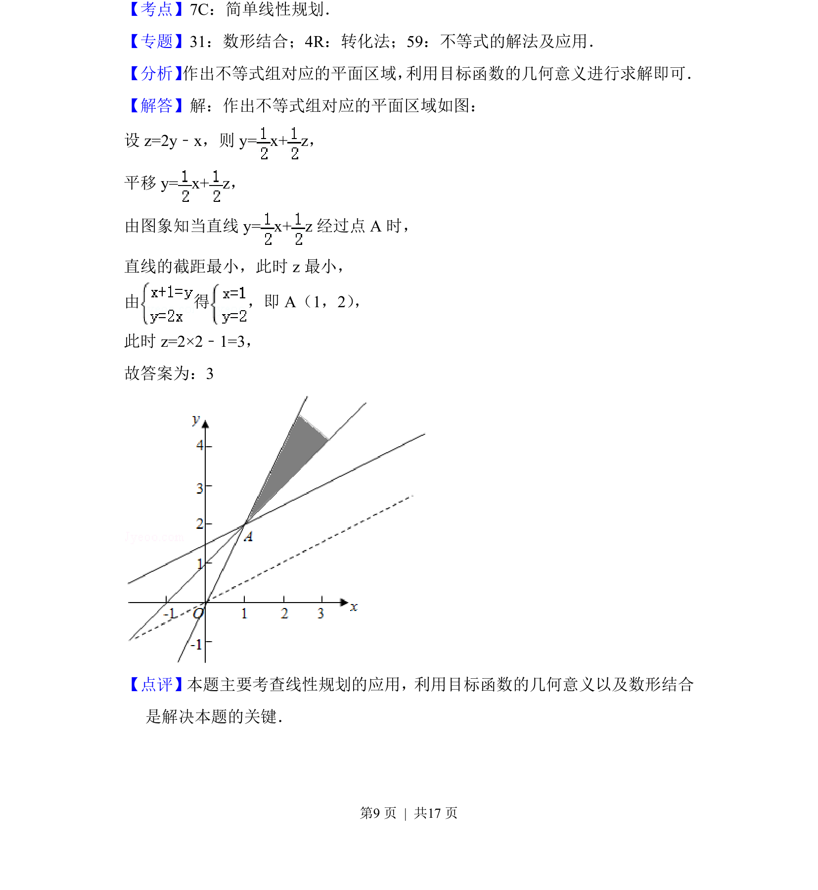

## 题面

## 摘要

该题考查线性规划中利用目标函数几何意义求最值，通过数形结合平移直线确定最优解。

## 关联考点

- [[1075-简单线性规划|线性规划]]
- [[目标函数几何意义]]
- [[898-数形结合|数形结合]]
- [[115-一元一次不等式组|不等式组]]

## 答案与解析

> 📄 原 PDF 第 9 页：`素材/真题/北京/2008-2024·（北京）数学高考真题/2018年高考数学试卷（文）（北京）（解析卷）.pdf`
