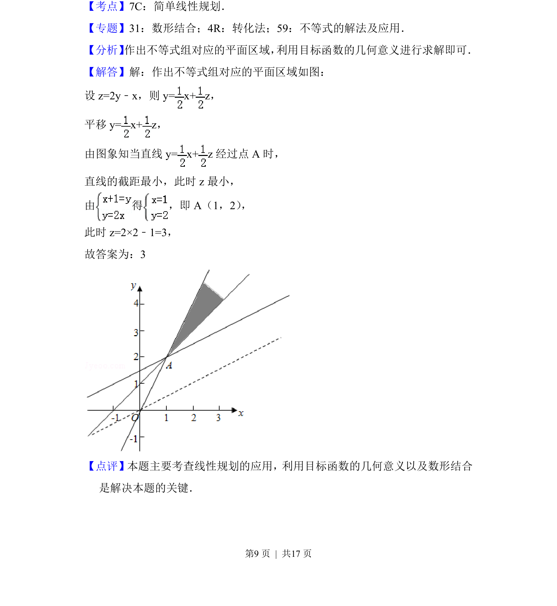

## 题面

## 摘要

该题考查线性规划中利用目标函数几何意义求最值，通过数形结合平移直线确定最优解。

## 关联考点

- [[1074-简单线性规划|线性规划]]
- [[1390-目标函数几何意义|目标函数几何意义]]
- [[897-数形结合|数形结合]]
- [[115-一元一次不等式组|不等式组]]

## 答案与解析

> 📄 原 PDF 第 9 页：`素材/真题/北京/2008-2024·（北京）数学高考真题/2018年高考数学试卷（文）（北京）（解析卷）.pdf`

<!-- 题干文本-start -->
## 题干文本
13． （5分）若x，y满足x+1≤y≤2x，则2y﹣x的最小值是　3　．
<!-- 题干文本-end -->

<!-- 解析文本-start -->
## 解析文本
【考点】7C：简单线性规划．菁优网版权所有
【专题】31：数形结合；4R：转化法；59：不等式的解法及应用．
【分析】 作出不等式组对应的平面区域， 利用目标函数的几何意义进行求解即可．
【解答】解：作出不等式组对应的平面区域如图：
设z=2y﹣x，则y= x+ z，
平移y= x+ z，
由图象知当直线y= x+ z经过点A时，
直线的截距最小，此时z最小，
由 得 ，即A（1，2） ，
此时z=2×2﹣1=3，
故答案为：3
【点评】 本题主要考查线性规划的应用， 利用目标函数的几何意义以及数形结合
是解决本题的关键．
<!-- 解析文本-end -->
