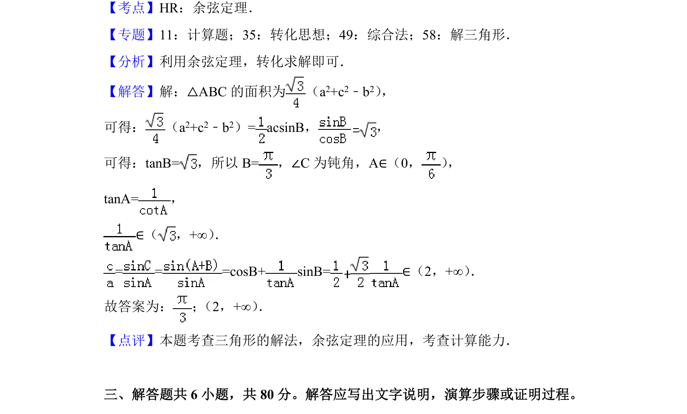

## 题面

## 摘要

本题考查已知三角形面积与边的关系求角度及边长比值的取值范围，涉及余弦定理、三角形面积公式及正切函数性质。

## 关联考点

- [[126-定理|余弦定理]]
- [[619-三角形面积公式|三角形面积公式]]
- [[308-正切函数图象与性质|正切函数]]
- [[623-不等式求解|不等式求解]]

## 答案与解析

> 📄 原 PDF 第 10 页：`素材/真题/北京/2008-2024·（北京）数学高考真题/2018年高考数学试卷（文）（北京）（解析卷）.pdf`
