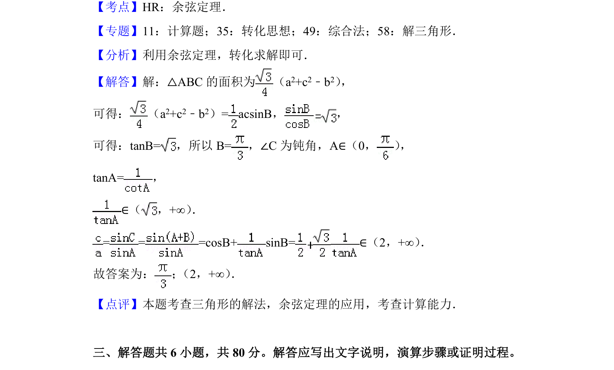

## 题面

## 摘要

本题考查已知三角形面积与边的关系求角度及边长比值的取值范围，涉及余弦定理、三角形面积公式及正切函数性质。

## 关联考点

- [[126-定理|余弦定理]]
- [[619-三角形面积公式|三角形面积公式]]
- [[308-正切函数图象与性质|正切函数]]
- [[623-不等式求解|不等式求解]]

## 答案与解析

> 📄 原 PDF 第 10 页：`素材/真题/北京/2008-2024·（北京）数学高考真题/2018年高考数学试卷（文）（北京）（解析卷）.pdf`

<!-- 题干文本-start -->
## 题干文本
14． （5分）若△ABC的面积为 （a 2+c2﹣b2） ，且∠C为钝角，则∠B=　 　；
的取值范围是　（2，+∞）　．
<!-- 题干文本-end -->

<!-- 解析文本-start -->
## 解析文本
【考点】HR：余弦定理．菁优网版权所有
【专题】11：计算题；35：转化思想；49：综合法；58：解三角形．
【分析】利用余弦定理，转化求解即可．
【解答】解：△ABC的面积为 （a 2+c2﹣b2） ，
可得： （a 2+c2﹣b2）= acsinB， ，
可得：tanB=，所以B=，∠C为钝角，A∈（0， ） ，
tanA=，
∈（ ，+∞） ．
= = =cosB+ sinB=∈（2，+∞） ．
故答案为： ； （2，+∞） ．
【点评】本题考查三角形的解法，余弦定理的应用，考查计算能力．
　
三、解答题共6小题，共80分。解答应写出文字说明，演算步骤或证明过程。
<!-- 解析文本-end -->
