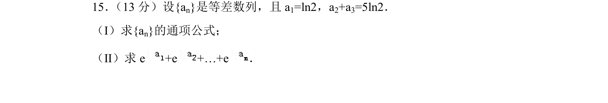
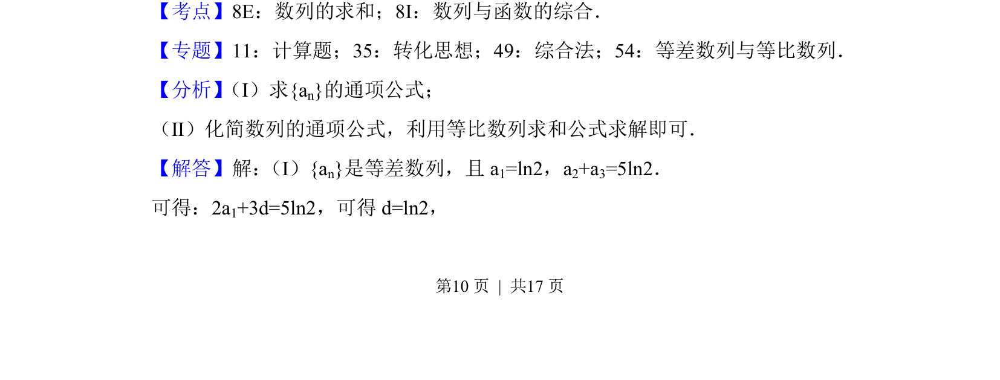
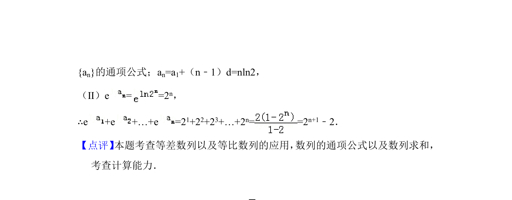

## 题面

## 摘要

已知等差数列部分项求通项，并求形如指数函数的数列和。

## 关联考点

- [[356-等差数列概念|等差数列]]
- [[357-等比数列前n项和|等比数列求和]]
- [[数列与函数综合]]

## 答案与解析

> 📄 原 PDF 第 10 页：`素材/真题/北京/2008-2024·（北京）数学高考真题/2018年高考数学试卷（文）（北京）（解析卷）.pdf`
