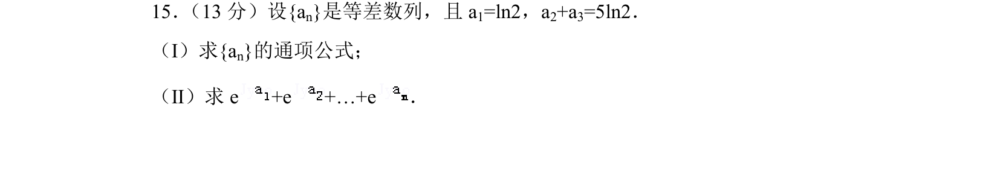
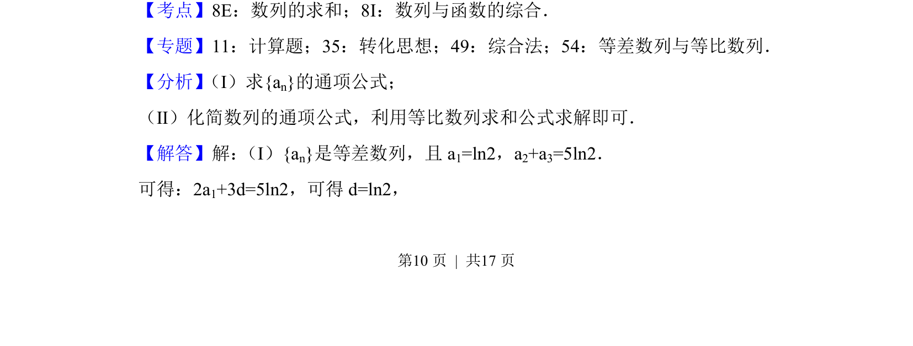
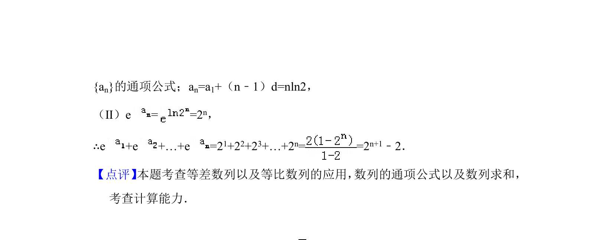

## 题面

## 摘要

已知等差数列部分项求通项，并求形如指数函数的数列和。

## 关联考点

- [[356-等差数列概念|等差数列]]
- [[357-等比数列前n项和|等比数列求和]]
- [[数列与函数综合]]

## 答案与解析

> 📄 原 PDF 第 10 页：`素材/真题/北京/2008-2024·（北京）数学高考真题/2018年高考数学试卷（文）（北京）（解析卷）.pdf`

<!-- 题干文本-start -->
## 题干文本
15． （13分）设{an}是等差数列，且a 1=ln2，a2+a3=5ln2．
（Ⅰ）求{an}的通项公式；
（Ⅱ）求e +e +…+e．
<!-- 题干文本-end -->

<!-- 解析文本-start -->
## 解析文本
【考点】8E：数列的求和；8I：数列与函数的综合．菁优网版权所有
【专题】11：计算题；35：转化思想；49：综合法；54：等差数列与等比数列．
【分析】 （Ⅰ）求{an}的通项公式；
（Ⅱ）化简数列的通项公式，利用等比数列求和公式求解即可．
【解答】解： （Ⅰ）{an}是等差数列，且a 1=ln2，a2+a3=5ln2．
可得：2a1+3d=5ln2，可得d=ln2，
<!-- 解析文本-end -->
