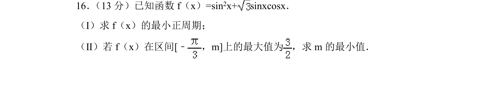
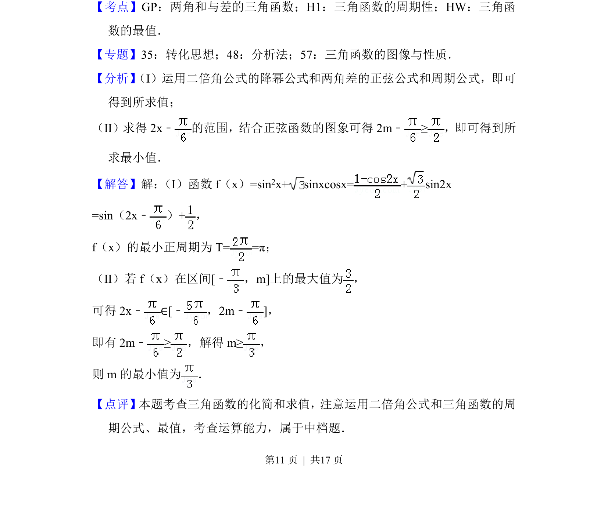

## 题面

## 摘要

求三角函数的最小正周期及给定区间上的最大值，进而确定参数的最小值。

## 关联考点

- [[628-两角和与差的三角函数|两角和与差的三角函数]]
- [[611-三角函数的周期性|三角函数的周期性]]
- [[615-三角函数的最值|三角函数的最值]]

## 答案与解析

> 📄 原 PDF 第 11 页：`素材/真题/北京/2008-2024·（北京）数学高考真题/2018年高考数学试卷（文）（北京）（解析卷）.pdf`

<!-- 题干文本-start -->
## 题干文本
16． （13分）已知函数f（x）=sin2x+ sinxcosx．
（Ⅰ）求f（x）的最小正周期；
（Ⅱ）若f（x）在区间[﹣，m]上的最大值为 ，求m的最小值．
<!-- 题干文本-end -->

<!-- 解析文本-start -->
## 解析文本
【考点】GP：两角和与差的三角函数；H1：三角函数的周期性；HW：三角函
数的最值．菁优网版权所有
【专题】35：转化思想；48：分析法；57：三角函数的图像与性质．
【分析】 （I）运用二倍角公式的降幂公式和两角差的正弦公式和周期公式，即可
得到所求值；
（Ⅱ）求得2x﹣的范围，结合正弦函数的图象可得2m﹣≥，即可得到所
求最小值．
【解答】解： （I）函数f（x）=sin2x+ sinxcosx= + sin2x
=sin（2x﹣）+，
f（x）的最小正周期为T==π；
（Ⅱ）若f（x）在区间[﹣，m]上的最大值为 ，
可得2x﹣∈[﹣，2m﹣]，
即有2m﹣≥，解得m≥，
则m的最小值为 ．
【点评】本题考查三角函数的化简和求值，注意运用二倍角公式和三角函数的周
期公式、最值，考查运算能力，属于中档题．
<!-- 解析文本-end -->
