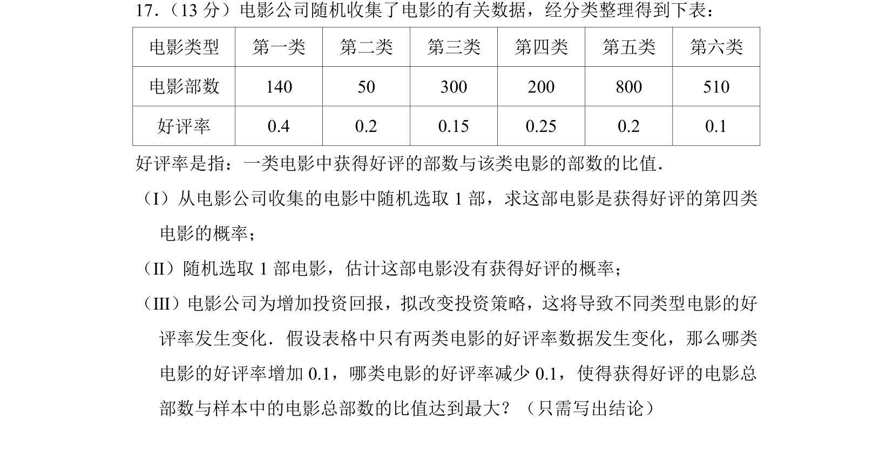
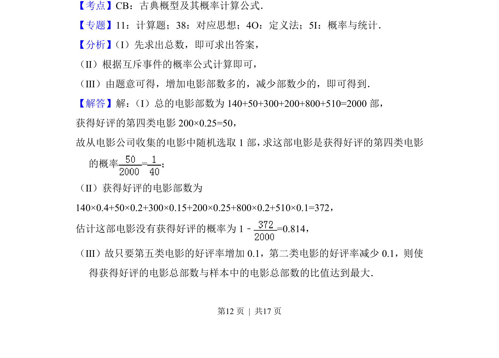
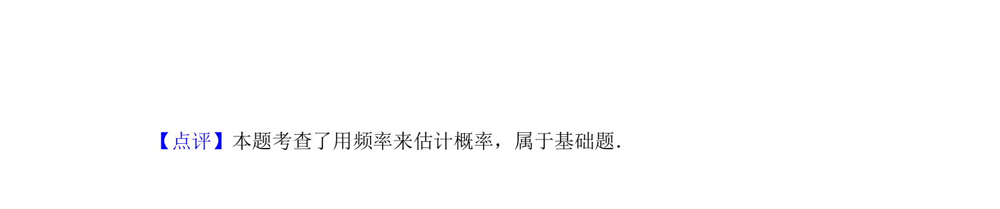

## 题面

## 摘要

本题通过电影分类数据考查概率计算与最优策略分析，涉及古典概型、互斥事件概率及统计估计。

## 关联考点

- [[320-古典概型|古典概型]]
- [[948-概率计算|概率计算]]
- [[317-事件的关系运算|互斥事件]]
- [[586-统计估计|统计估计]]

## 答案与解析

> 📄 原 PDF 第 12 页：`素材/真题/北京/2008-2024·（北京）数学高考真题/2018年高考数学试卷（文）（北京）（解析卷）.pdf`
