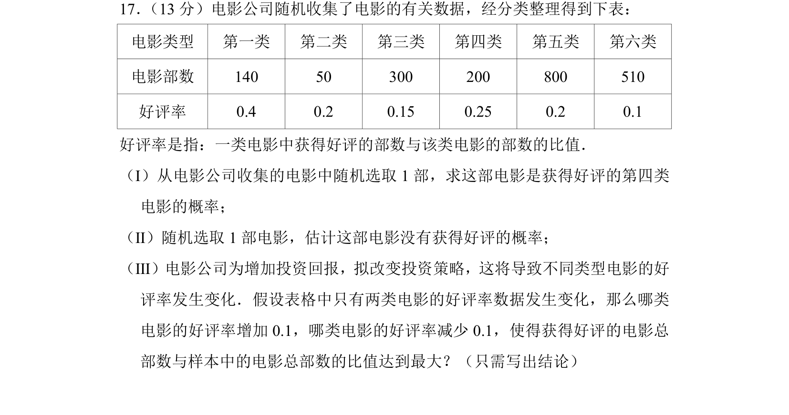
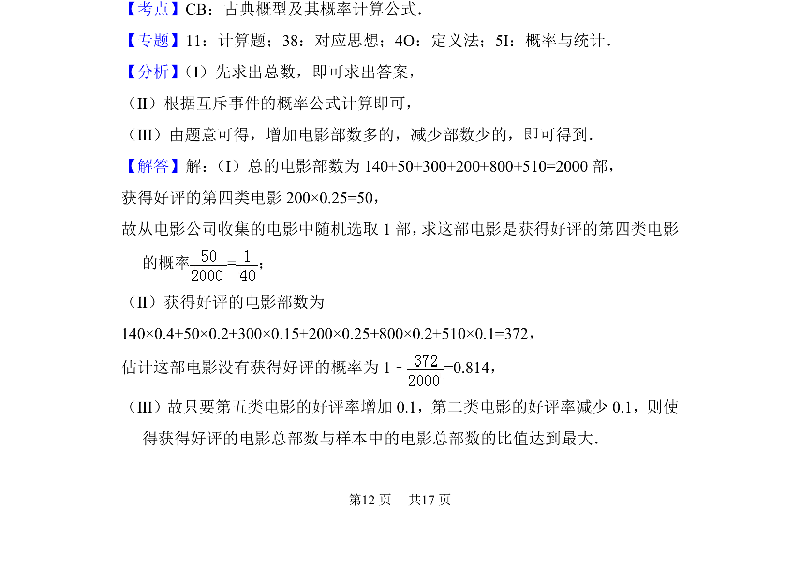

## 题面

## 摘要

本题通过电影分类数据考查概率计算与最优策略分析，涉及古典概型、互斥事件概率及统计估计。

## 关联考点

- [[320-古典概型|古典概型]]
- [[948-概率计算|概率计算]]
- [[317-事件的关系运算|互斥事件]]
- [[586-统计估计|统计估计]]

## 答案与解析

> 📄 原 PDF 第 12 页：`素材/真题/北京/2008-2024·（北京）数学高考真题/2018年高考数学试卷（文）（北京）（解析卷）.pdf`

<!-- 题干文本-start -->
## 题干文本
17． （13分）电影公司随机收集了电影的有关数据，经分类整理得到下表：
电影类型 第一类 第二类 第三类 第四类 第五类 第六类
电影部数 140 50 300 200 800 510
好评率 0.4 0.2 0.15 0.25 0.2 0.1
好评率是指：一类电影中获得好评的部数与该类电影的部数的比值．
（Ⅰ）从电影公司收集的电影中随机选取1部，求这部电影是获得好评的第四类
电影的概率；
（Ⅱ）随机选取1部电影，估计这部电影没有获得好评的概率；
（Ⅲ）电影公司为增加投资回报，拟改变投资策略，这将导致不同类型电影的好
评率发生变化．假设表格中只有两类电影的好评率数据发生变化，那么哪类
电影的好评率增加0.1，哪类电影的好评率减少0.1，使得获得好评的电影总
部数与样本中的电影总部数的比值达到最大？（只需写出结论）
<!-- 题干文本-end -->

<!-- 解析文本-start -->
## 解析文本
【考点】CB：古典概型及其概率计算公式．菁优网版权所有
【专题】11：计算题；38：对应思想；4O：定义法；5I：概率与统计．
【分析】 （Ⅰ）先求出总数，即可求出答案，
（Ⅱ）根据互斥事件的概率公式计算即可，
（Ⅲ）由题意可得，增加电影部数多的，减少部数少的，即可得到．
【解答】解： （Ⅰ）总的电影部数为140+50+300+200+800+510=2000部，
获得好评的第四类电影200×0.25=50，
故从电影公司收集的电影中随机选取1部， 求这部电影是获得好评的第四类电影
的概率=；
（Ⅱ）获得好评的电影部数为
140×0.4+50×0.2+300×0.15+200×0.25+800×0.2+510×0.1=372，
估计这部电影没有获得好评的概率为1﹣=0.814，
（Ⅲ）故只要第五类电影的好评率增加0.1，第二类电影的好评率减少0.1，则使
得获得好评的电影总部数与样本中的电影总部数的比值达到最大．
<!-- 解析文本-end -->
