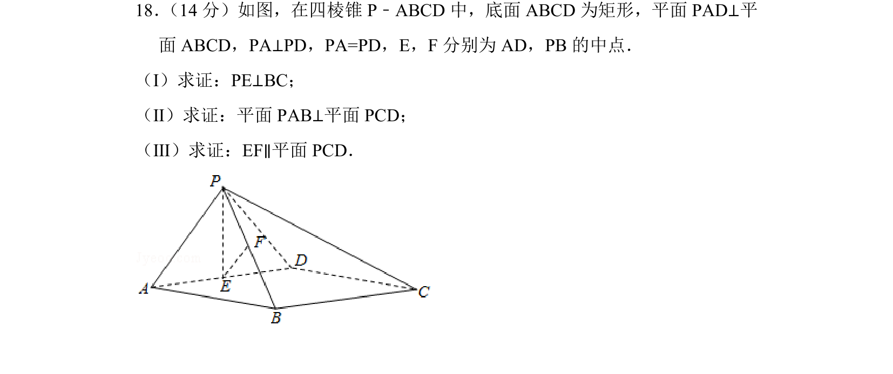
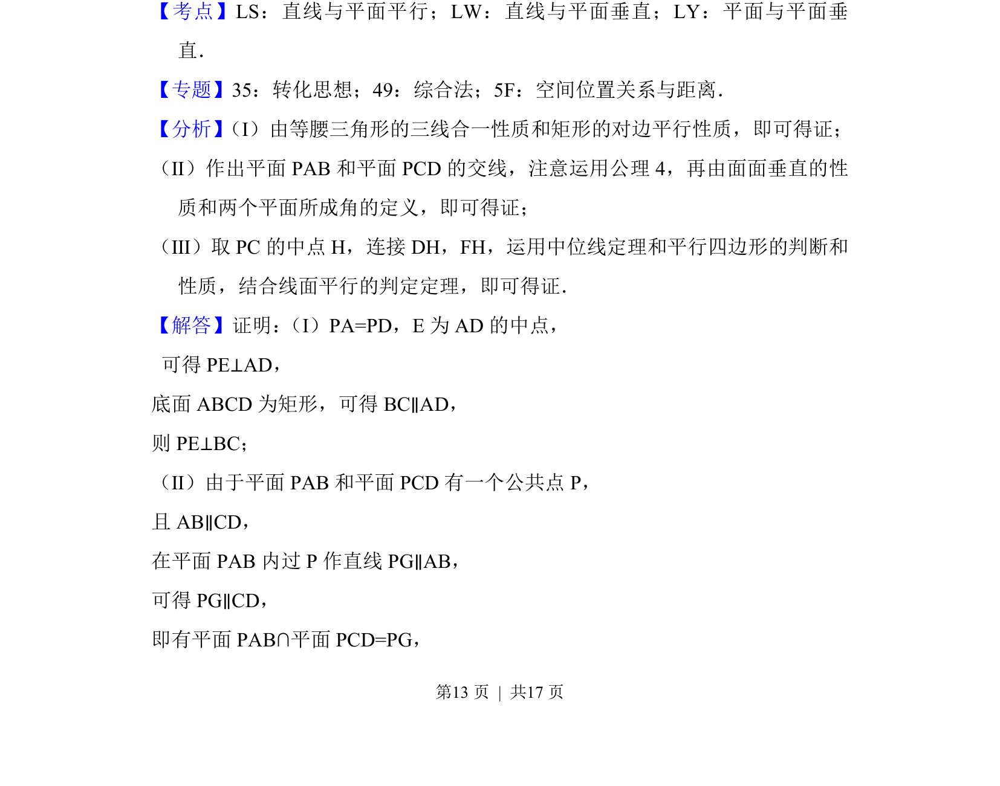
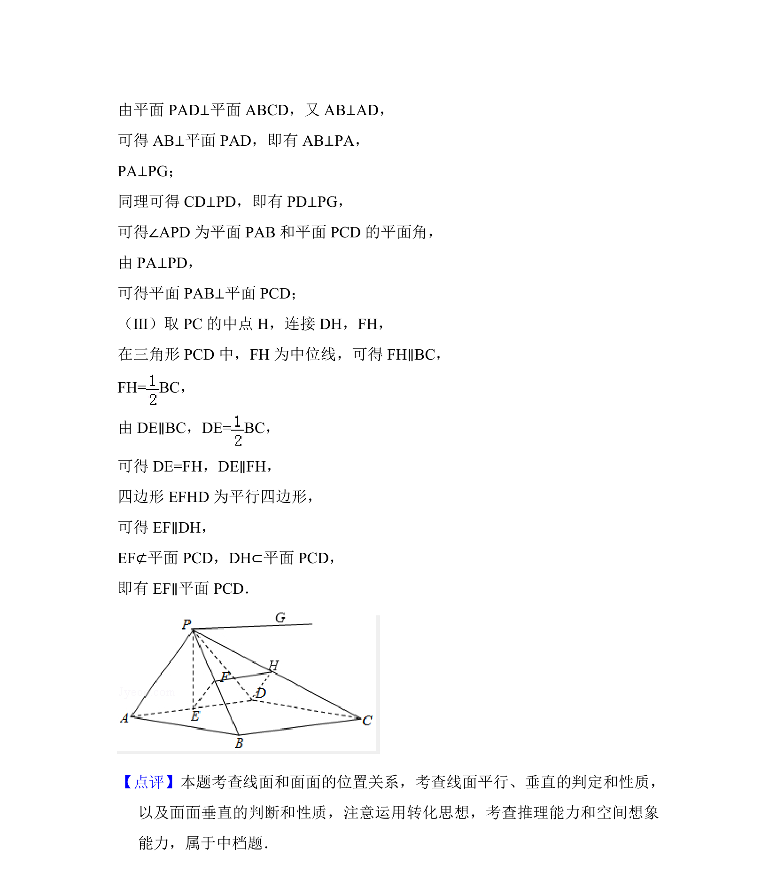

## 题面

## 摘要

证明四棱锥中的线线垂直、面面垂直与线面平行

## 关联考点

- [[1010-直线与平面垂直|直线与平面垂直]]
- [[1397-平面与平面垂直|平面与平面垂直]]
- [[1011-直线与平面平行|直线与平面平行]]

## 答案与解析

> 📄 原 PDF 第 13 页：`素材/真题/北京/2008-2024·（北京）数学高考真题/2018年高考数学试卷（文）（北京）（解析卷）.pdf`

<!-- 题干文本-start -->
## 题干文本
18． （14分）如图，在四棱锥P﹣ABCD中，底面ABCD为矩形，平面PAD⊥平
面ABCD，PA⊥PD，PA=PD，E，F分别为AD，PB的中点．
（Ⅰ）求证：PE⊥BC；
（Ⅱ）求证：平面PAB⊥平面PCD；
（Ⅲ）求证：EF∥平面PCD．
<!-- 题干文本-end -->

<!-- 解析文本-start -->
## 解析文本
【考点】LS：直线与平面平行；LW：直线与平面垂直；LY：平面与平面垂
直．菁
【专题】35：转化思想；49：综合法；5F：空间位置关系与距离．
【分析】 （Ⅰ）由等腰三角形的三线合一性质和矩形的对边平行性质，即可得证；
（Ⅱ）作出平面PAB和平面PCD的交线，注意运用公理4，再由面面垂直的性
质和两个平面所成角的定义，即可得证；
（Ⅲ）取PC的中点H，连接DH，FH，运用中位线定理和平行四边形的判断和
性质，结合线面平行的判定定理，即可得证．
【解答】证明： （Ⅰ）PA=PD，E为AD的中点，
 可得PE⊥AD，
底面ABCD为矩形，可得BC∥AD，
则PE⊥BC；
（Ⅱ）由于平面PAB和平面PCD有一个公共点P，
且AB∥CD，
在平面PAB内过P作直线PG∥AB，
可得PG∥CD，
即有平面PAB∩平面PCD=PG，
<!-- 解析文本-end -->
