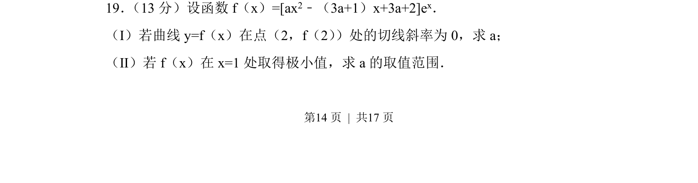
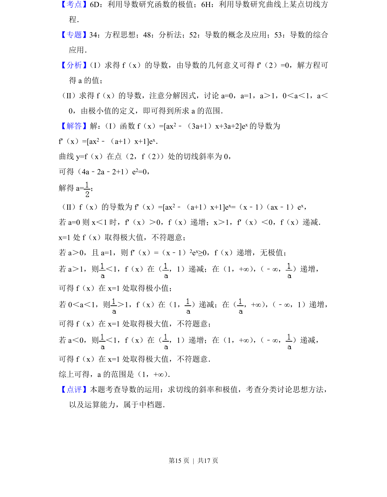

## 题面

## 摘要

考查含参指数函数的切线斜率与极小值条件，通过导数求解参数及取值范围

## 关联考点

- [[440-导数的几何意义|导数的几何意义]]
- [[极值条件]]
- [[721-参数取值范围|参数取值范围]]
- [[含参函数]]

## 答案与解析

> 📄 原 PDF 第 14 页：`素材/真题/北京/2008-2024·（北京）数学高考真题/2018年高考数学试卷（文）（北京）（解析卷）.pdf`
