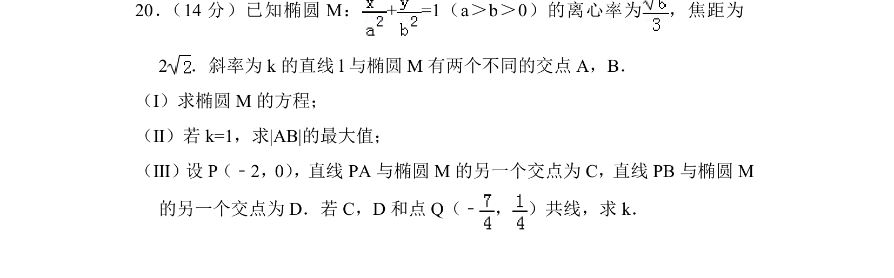
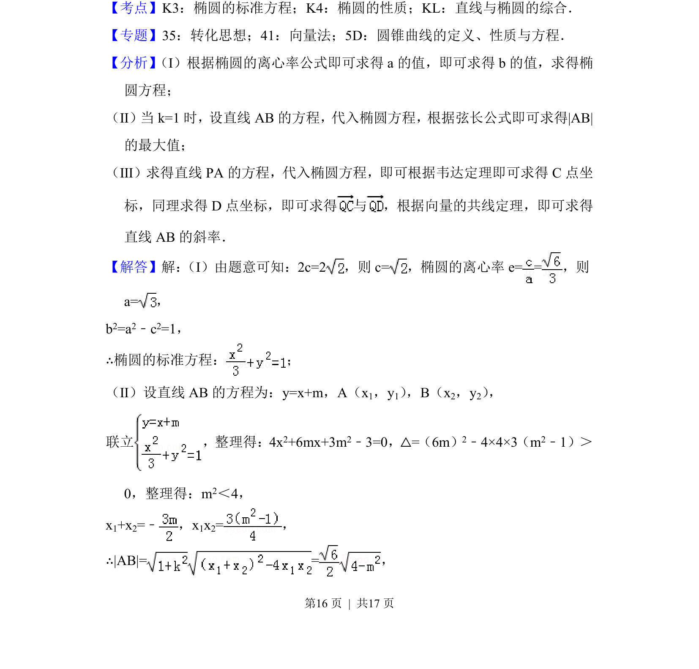
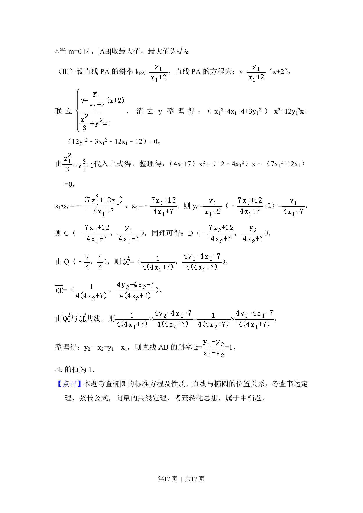

## 题面

## 摘要

已知椭圆离心率和焦距求标准方程，并研究直线与椭圆相交的弦长最大值和向量共线求斜率问题。

## 关联考点

- [[061-方程|椭圆的标准方程]]
- [[945-椭圆的性质|椭圆的性质]]
- [[1361-直线与椭圆的综合|直线与椭圆的综合]]

## 答案与解析

> 📄 原 PDF 第 16 页：`素材/真题/北京/2008-2024·（北京）数学高考真题/2018年高考数学试卷（文）（北京）（解析卷）.pdf`
