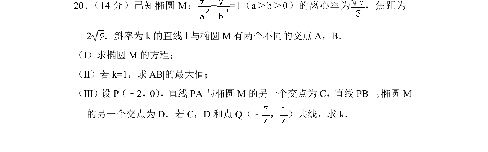
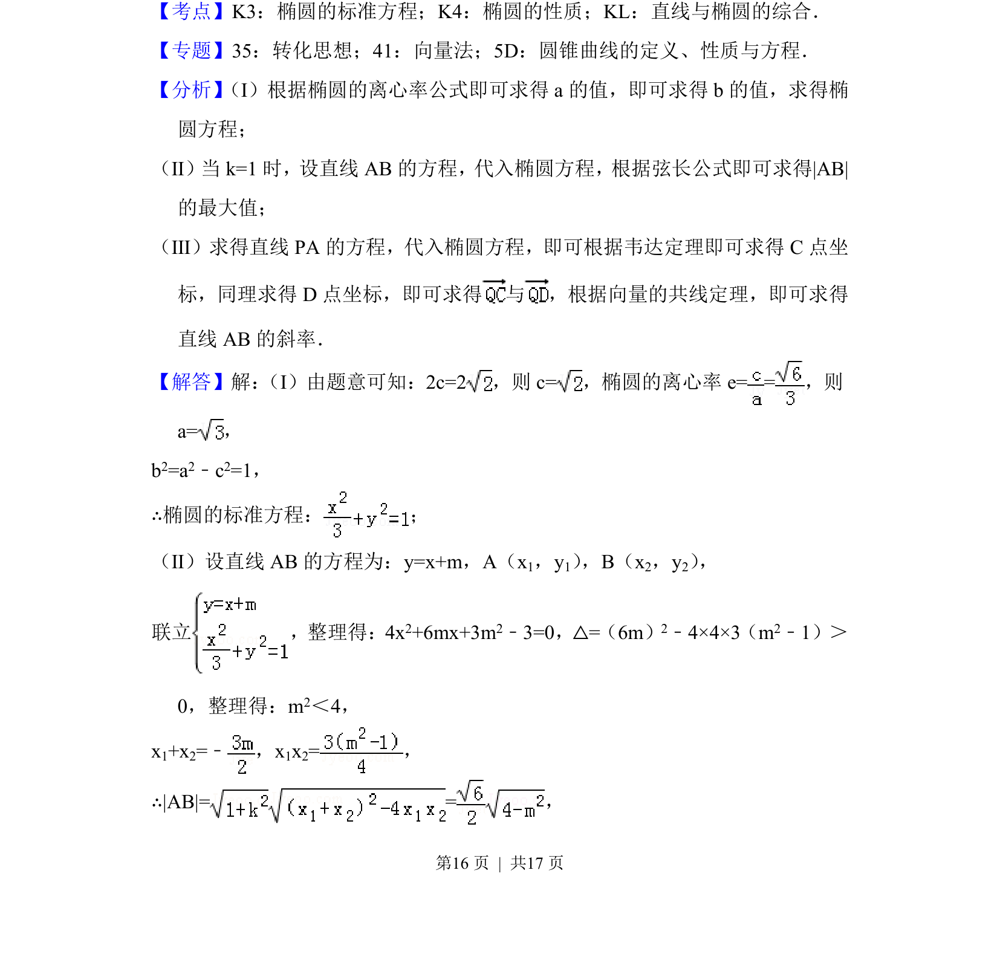
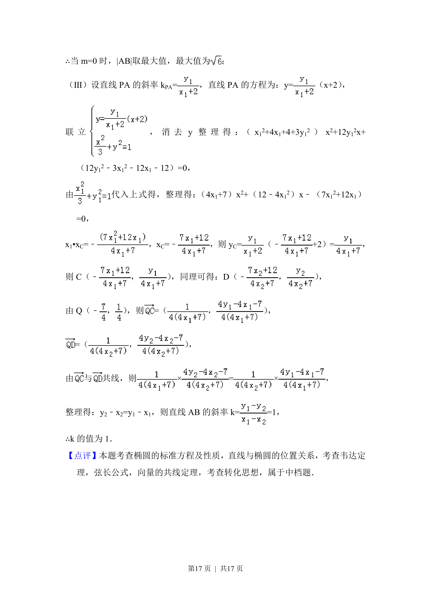

## 题面

## 摘要

已知椭圆离心率和焦距求标准方程，并研究直线与椭圆相交的弦长最大值和向量共线求斜率问题。

## 关联考点

- [[061-方程|椭圆的标准方程]]
- [[944-椭圆的性质|椭圆的性质]]
- [[575-直线与椭圆综合|直线与椭圆的综合]]

## 答案与解析

> 📄 原 PDF 第 16 页：`素材/真题/北京/2008-2024·（北京）数学高考真题/2018年高考数学试卷（文）（北京）（解析卷）.pdf`

<!-- 题干文本-start -->
## 题干文本
20． （14分）已知椭圆M：+ =1（a＞b＞0）的离心率为 ，焦距为
2．斜率为k的直线l与椭圆M有两个不同的交点A，B．
（Ⅰ）求椭圆M的方程；
（Ⅱ）若k=1，求|AB|的最大值；
（Ⅲ）设P（﹣2，0） ，直线PA与椭圆M的另一个交点为C，直线PB与椭圆M
的另一个交点为D．若C，D和点Q（﹣， ）共线，求k．
<!-- 题干文本-end -->

<!-- 解析文本-start -->
## 解析文本
【考点】K3：椭圆的标准方程；K4：椭圆的性质；KL：直线与椭圆的综合．菁优网版权所有
【专题】35：转化思想；41：向量法；5D：圆锥曲线的定义、性质与方程．
【分析】 （Ⅰ）根据椭圆的离心率公式即可求得a的值，即可求得b的值，求得椭
圆方程；
（Ⅱ）当k=1时，设直线AB的方程，代入椭圆方程，根据弦长公式即可求得|AB|
的最大值；
（Ⅲ）求得直线PA的方程，代入椭圆方程，即可根据韦达定理即可求得C点坐
标，同理求得D点坐标，即可求得 与 ，根据向量的共线定理，即可求得
直线AB的斜率．
【解答】解： （Ⅰ）由题意可知：2c=2，则c=，椭圆的离心率e= =，则
a=，
b2=a2﹣c2=1，
∴椭圆的标准方程： ；
（Ⅱ）设直线AB的方程为：y=x+m，A（x 1，y1） ，B（x2，y2） ，
联立 ，整理得：4x 2+6mx+3m2﹣3=0，△=（6m）2﹣4×4×3（m2﹣1）＞
0，整理得：m2＜4，
x1+x2=﹣，x 1x2=，
∴|AB|= =，
<!-- 解析文本-end -->
