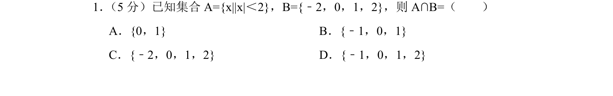
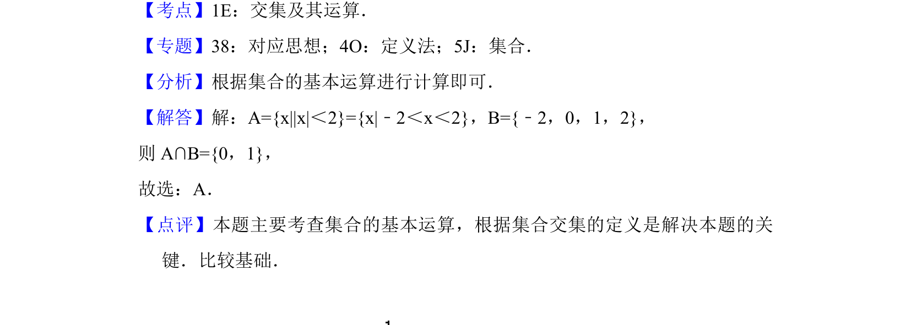

## 题面

## 摘要

本题考查含绝对值不等式的集合交集运算。

## 关联考点

- [[1092-绝对值不等式|绝对值不等式]]
- [[645-交集及其运算|交集及其运算]]

## 答案与解析

> 📄 原 PDF 第 1 页：`素材/真题/北京/2008-2024·（北京）数学高考真题/2018年高考数学试卷（理）（北京）（解析卷）.pdf`

<!-- 题干文本-start -->
## 题干文本
1． （5分）已知集合A={x||x|＜2}，B={﹣2，0，1，2}，则A∩B=（　　）
A．{0，1} B．{﹣1，0，1}
C．{﹣2，0，1，2} D．{﹣1，0，1，2}
<!-- 题干文本-end -->

<!-- 解析文本-start -->
## 解析文本
【考点】1E：交集及其运算．菁优网版权所有
【专题】38：对应思想；4O：定义法；5J：集合．
【分析】根据集合的基本运算进行计算即可．
【解答】解：A={x||x|＜2}={x|﹣2＜x＜2}，B={﹣2，0，1，2}，
则A∩B={0，1}，
故选：A．
【点评】本题主要考查集合的基本运算，根据集合交集的定义是解决本题的关
键．比较基础．
<!-- 解析文本-end -->
