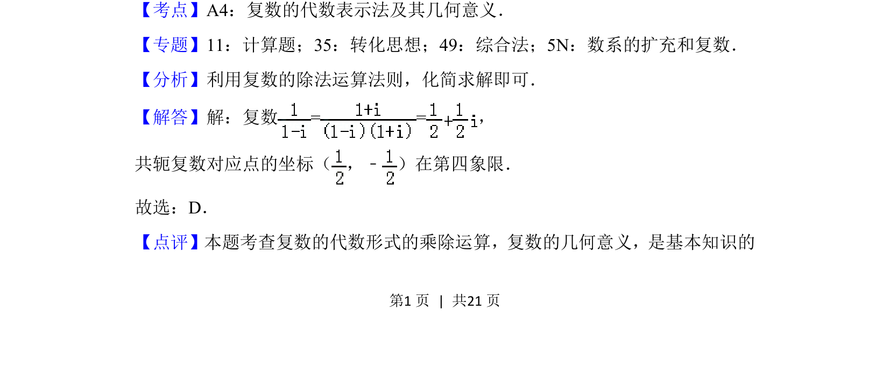

## 题面

## 摘要

本题考查复数的代数运算及其共轭复数在复平面中的象限判断。

## 关联考点

- [[809-复数的运算|复数的运算]]
- [[333-复数的几何意义|复数的几何意义]]
- [[534-共轭复数|共轭复数]]

## 答案与解析

> 📄 原 PDF 第 1 页：`素材/真题/北京/2008-2024·（北京）数学高考真题/2018年高考数学试卷（理）（北京）（解析卷）.pdf`
