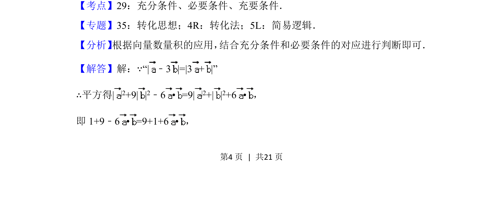
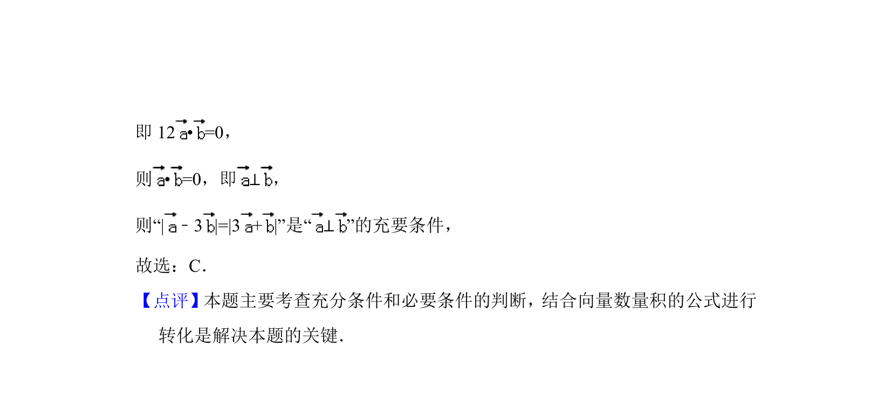

## 题面

## 摘要

本题通过向量模长等式推导数量积，考查单位向量垂直的充分必要条件判断。

## 关联考点

- [[278-充分条件必要条件|充分条件]]
- [[278-充分条件必要条件|必要条件]]
- [[279-充要条件|充要条件]]
- [[751-向量数量积|向量数量积]]

## 答案与解析

> 📄 原 PDF 第 4 页：`素材/真题/北京/2008-2024·（北京）数学高考真题/2018年高考数学试卷（理）（北京）（解析卷）.pdf`
