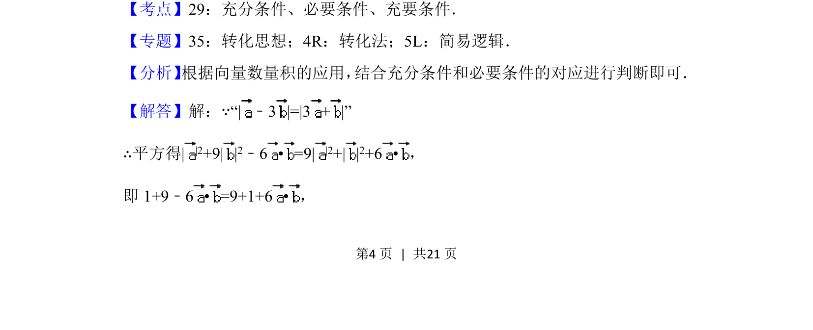
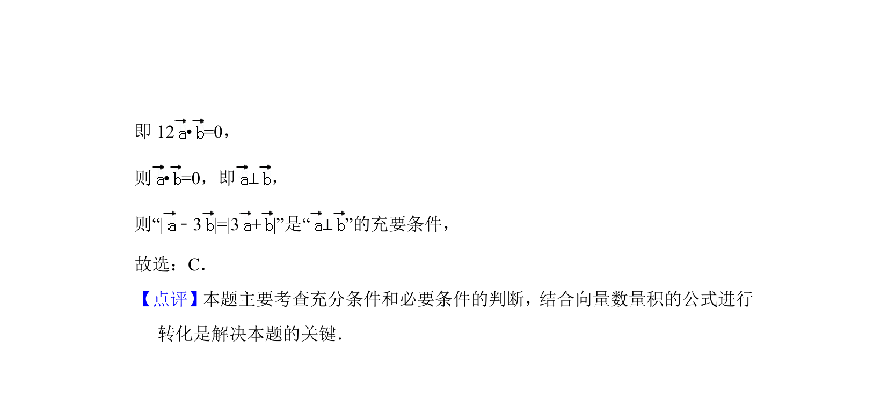

## 题面

## 摘要

本题通过向量模长等式推导数量积，考查单位向量垂直的充分必要条件判断。

## 关联考点

- [[278-充分条件必要条件|充分条件]]
- [[278-充分条件必要条件|必要条件]]
- [[279-充要条件|充要条件]]
- [[328-向量的数量积|向量数量积]]

## 答案与解析

> 📄 原 PDF 第 4 页：`素材/真题/北京/2008-2024·（北京）数学高考真题/2018年高考数学试卷（理）（北京）（解析卷）.pdf`

<!-- 题干文本-start -->
## 题干文本
6． （5分）设 ， 均为单位向量，则“|﹣3 |=|3 + |”是“⊥”的（　　）
A．充分而不必要条件B．必要而不充分条件
C．充分必要条件D．既不充分也不必要条件
<!-- 题干文本-end -->

<!-- 解析文本-start -->
## 解析文本
【考点】29：充分条件、必要条件、充要条件．菁优网版权所有
【专题】35：转化思想；4R：转化法；5L：简易逻辑．
【分析】 根据向量数量积的应用， 结合充分条件和必要条件的对应进行判断即可．
【解答】解：∵“|﹣3 |=|3 + |”
∴平方得| |2+9| | 2﹣6 • =9| |2+| | 2+6 •，
即1+9﹣6 • =9+1+6 •，
<!-- 解析文本-end -->
