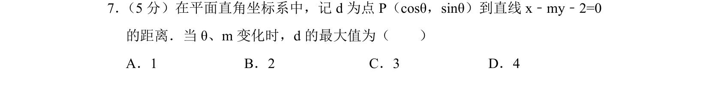
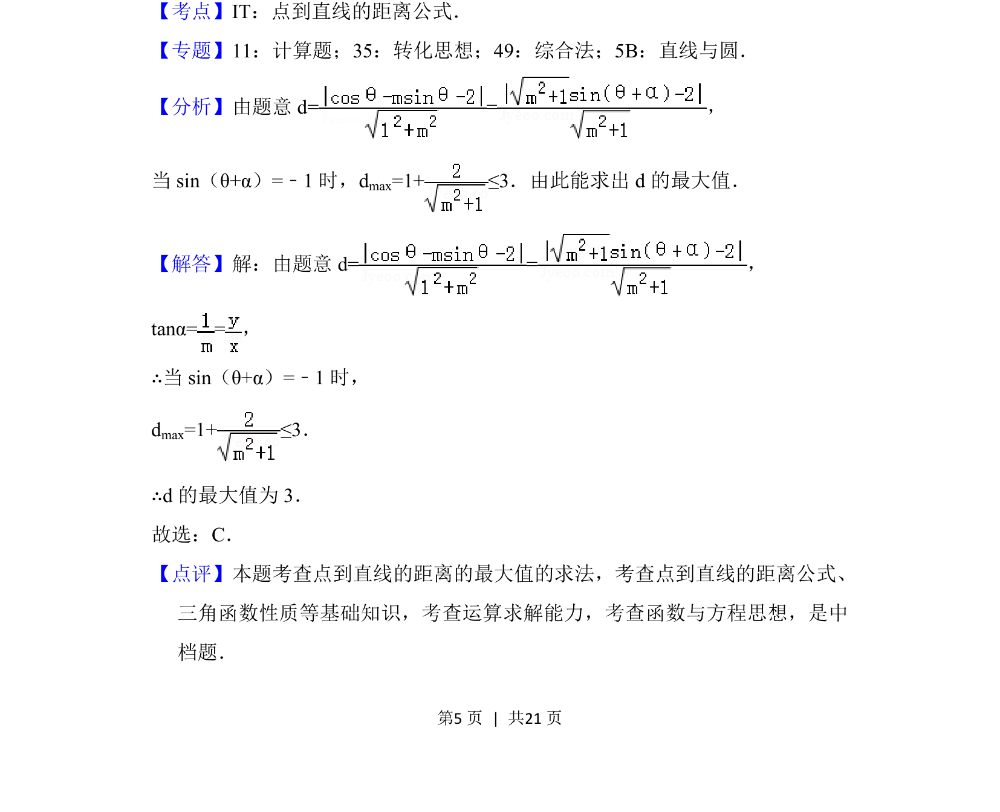

## 题面

## 摘要

求参数变化时点到直线的距离的最大值，综合点到直线距离公式与三角函数性质。

## 关联考点

- [[392-点到直线距离公式|点到直线距离公式]]
- [[608-三角函数有界性|三角函数有界性]]
- [[419-函数最值-高中|函数最值]]

## 答案与解析

> 📄 原 PDF 第 5 页：`素材/真题/北京/2008-2024·（北京）数学高考真题/2018年高考数学试卷（理）（北京）（解析卷）.pdf`
