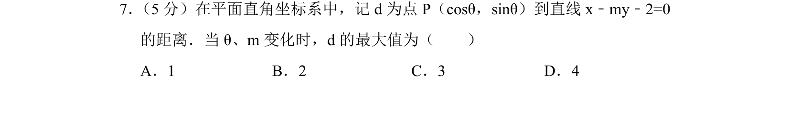
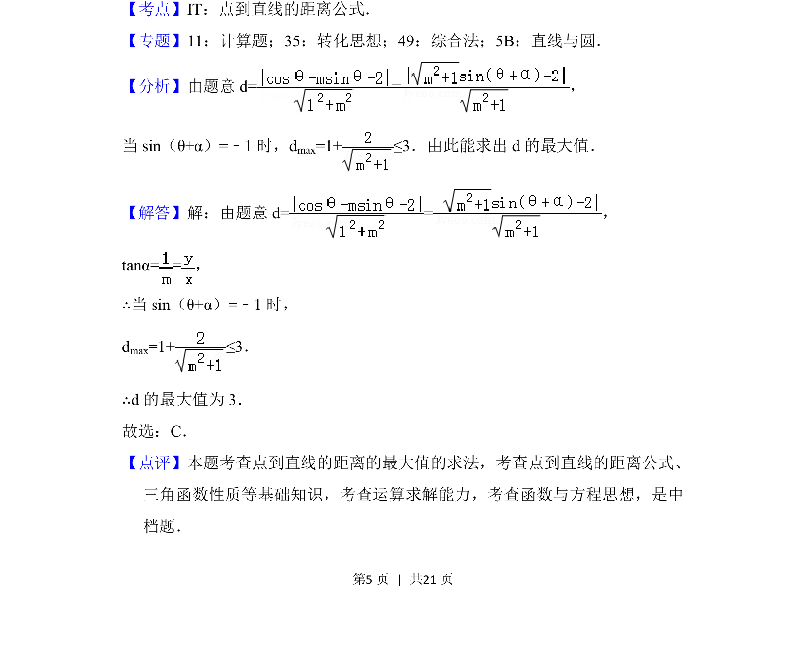

## 题面

## 摘要

求参数变化时点到直线的距离的最大值，综合点到直线距离公式与三角函数性质。

## 关联考点

- [[570-点到直线的距离公式|点到直线距离公式]]
- [[608-三角函数有界性|三角函数有界性]]
- [[419-函数最值-高中|函数最值]]

## 答案与解析

> 📄 原 PDF 第 5 页：`素材/真题/北京/2008-2024·（北京）数学高考真题/2018年高考数学试卷（理）（北京）（解析卷）.pdf`

<!-- 题干文本-start -->
## 题干文本
7． （5分）在平面直角坐标系中，记d为点P（cosθ，sinθ）到直线x﹣my﹣2=0
的距离．当θ、m变化时，d的最大值为（　　）
A．1 B．2 C．3 D．4
<!-- 题干文本-end -->

<!-- 解析文本-start -->
## 解析文本
【考点】IT：点到直线的距离公式．菁优网版权所有
【专题】11：计算题；35：转化思想；49：综合法；5B：直线与圆．
【分析】由题意d= =，
当sin（θ+α）=﹣1时，d max=1+≤3．由此能求出d的最大值．
【解答】解：由题意d= =，
tanα==，
∴当sin（θ+α）=﹣1时，
dmax=1+≤3．
∴d的最大值为3．
故选：C．
【点评】本题考查点到直线的距离的最大值的求法，考查点到直线的距离公式、
三角函数性质等基础知识，考查运算求解能力，考查函数与方程思想，是中
档题．
<!-- 解析文本-end -->
