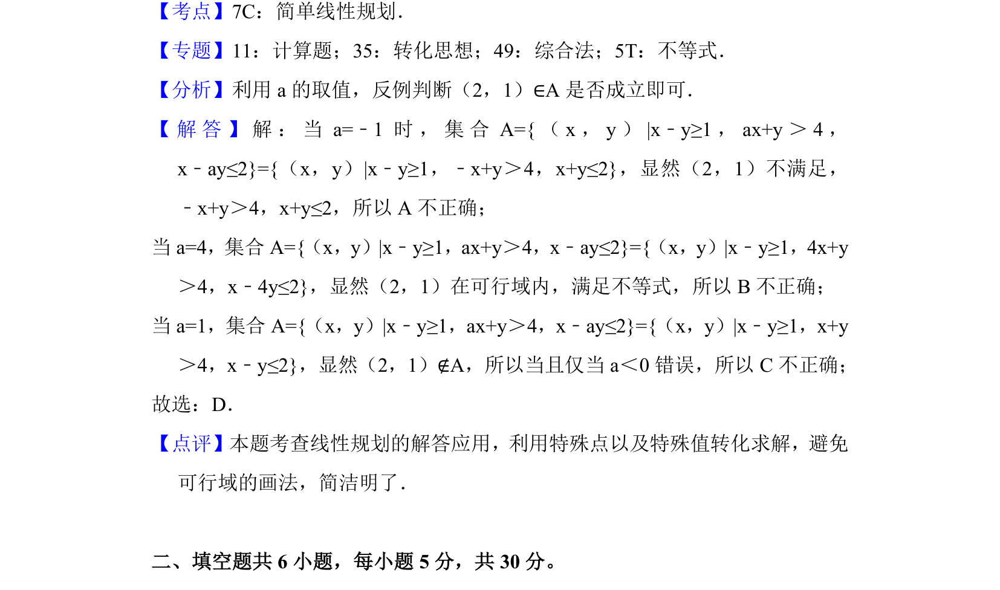

## 题面

## 摘要

判断点是否满足含参线性不等式组，利用特殊值排除法

## 关联考点

- [[042-集合|集合]]
- [[1074-简单线性规划|线性规划]]
- [[083-不等式|不等式]]

## 答案与解析

> 📄 原 PDF 第 6 页：`素材/真题/北京/2008-2024·（北京）数学高考真题/2018年高考数学试卷（理）（北京）（解析卷）.pdf`

<!-- 题干文本-start -->
## 题干文本
8． （5分）设集合A={（x，y）|x﹣y≥1，ax+y＞4，x﹣ay≤2}，则（　　）
A．对任意实数a， （2，1）∈A B．对任意实数a， （2，1）∉A
C．当且仅当a＜0时， （2，1）∉A D．当且仅当a≤时， （2，1）∉A
<!-- 题干文本-end -->

<!-- 解析文本-start -->
## 解析文本
【考点】7C：简单线性规划．菁优网版权所有
【专题】11：计算题；35：转化思想；49：综合法；5T：不等式．
【分析】利用a的取值，反例判断（2，1）∈A是否成立即可．
【 解 答 】 解 ： 当a=﹣1时 ， 集 合A={（x，y）|x﹣y≥1，ax+y＞4，
x﹣ay≤2}={（x，y）|x﹣y≥1，﹣x+y＞4，x+y≤2}，显然（2，1）不满足，
﹣x+y＞4，x+y≤2，所以A不正确；
当a=4，集合A={（x，y）|x﹣y≥1，ax+y＞4，x﹣ay≤2}={（x，y）|x﹣y≥1，4x+y
＞4，x﹣4y≤2}，显然（2，1）在可行域内，满足不等式，所以B不正确；
当a=1，集合A={（x，y）|x﹣y≥1，ax+y＞4，x﹣ay≤2}={（x，y）|x﹣y≥1，x+y
＞4，x﹣y≤2}，显然（2，1）∉A，所以当且仅当a＜0错误，所以C不正确；
故选：D．
【点评】本题考查线性规划的解答应用，利用特殊点以及特殊值转化求解，避免
可行域的画法，简洁明了．
　
二、填空题共6小题，每小题5分，共30分。
<!-- 解析文本-end -->
