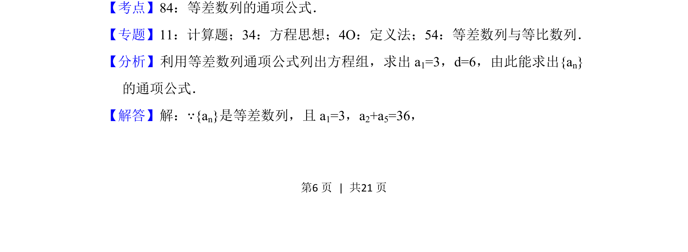
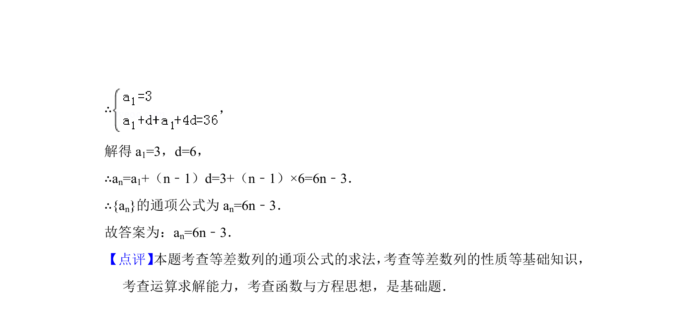

## 题面

## 摘要

已知等差数列首项及两项和，通过方程组求解公差与通项公式。

## 关联考点

- [[356-等差数列概念|等差数列]]
- [[384-数列通项公式|通项公式]]
- [[116-七下-二元一次方程组|方程组]]

## 答案与解析

> 📄 原 PDF 第 6 页：`素材/真题/北京/2008-2024·（北京）数学高考真题/2018年高考数学试卷（理）（北京）（解析卷）.pdf`
