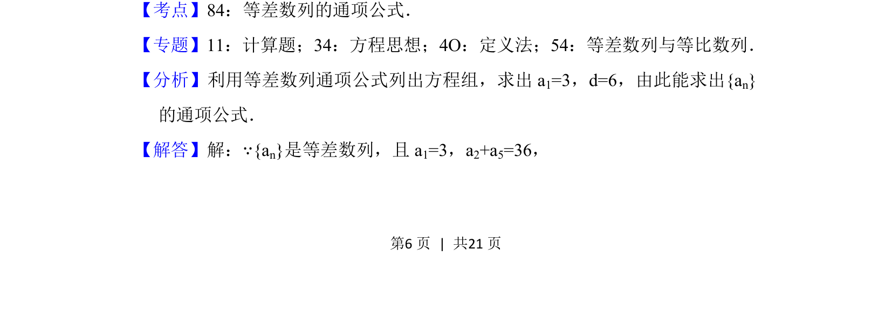
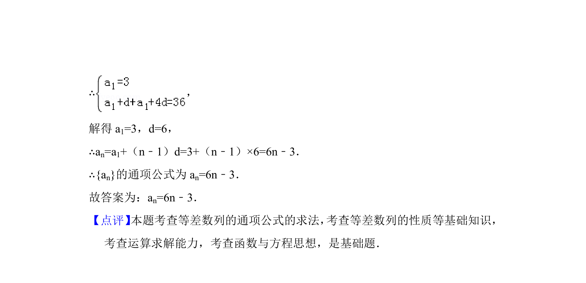

## 题面

## 摘要

已知等差数列首项及两项和，通过方程组求解公差与通项公式。

## 关联考点

- [[356-等差数列概念|等差数列]]
- [[384-数列通项公式|通项公式]]
- [[116-七下-二元一次方程组|方程组]]

## 答案与解析

> 📄 原 PDF 第 6 页：`素材/真题/北京/2008-2024·（北京）数学高考真题/2018年高考数学试卷（理）（北京）（解析卷）.pdf`

<!-- 题干文本-start -->
## 题干文本
9． （5分）设{an}是等差数列，且a 1=3，a2+a5=36，则{an}的通项公式为　
an=6n﹣3　．
<!-- 题干文本-end -->

<!-- 解析文本-start -->
## 解析文本
【考点】84：等差数列的通项公式．菁优网版权所有
【专题】11：计算题；34：方程思想；4O：定义法；54：等差数列与等比数列．
【分析】利用等差数列通项公式列出方程组，求出a 1=3，d=6，由此能求出{an}
的通项公式．
【解答】解：∵{an}是等差数列，且a 1=3，a2+a5=36，
<!-- 解析文本-end -->
