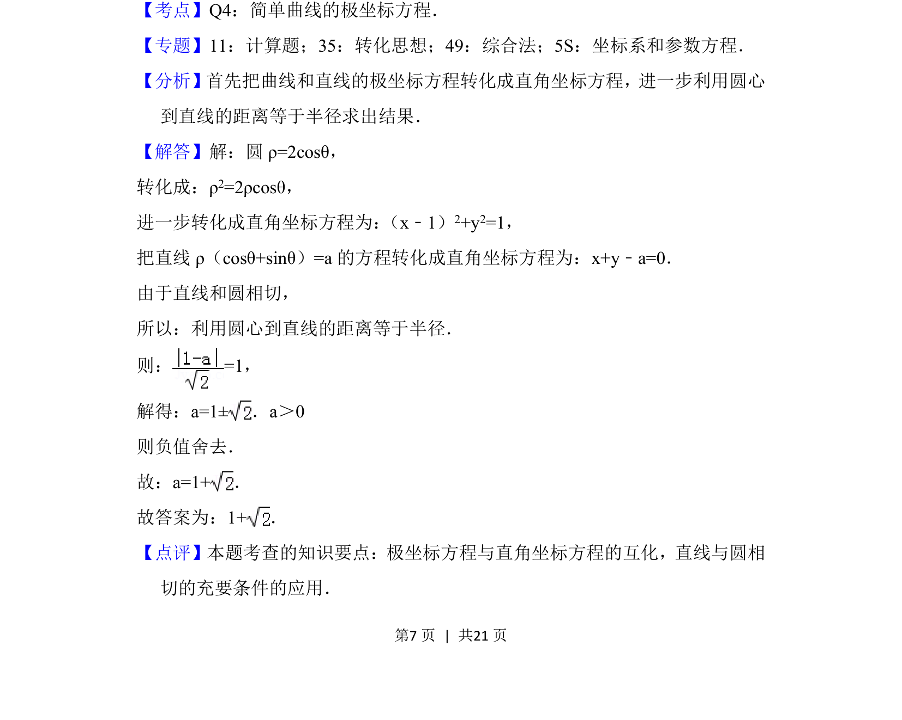

## 题面

## 摘要

极坐标下直线与圆相切，求参数值

## 关联考点

- [[极坐标方程与直角坐标方程互化]]
- [[1005-直线与圆相切|直线与圆相切]]
- [[981-点到直线的距离|点到直线的距离]]

## 答案与解析

> 📄 原 PDF 第 7 页：`素材/真题/北京/2008-2024·（北京）数学高考真题/2018年高考数学试卷（理）（北京）（解析卷）.pdf`
