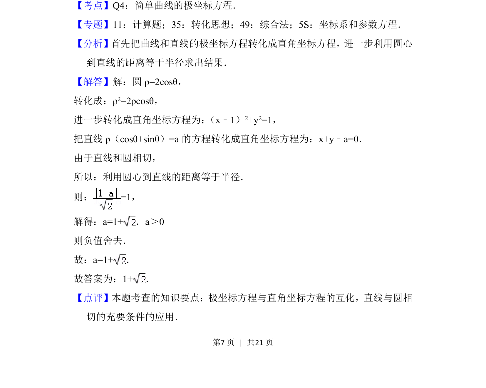

## 题面

## 摘要

极坐标下直线与圆相切，求参数值

## 关联考点

- [[极坐标方程与直角坐标方程互化]]
- [[1004-直线与圆相切|直线与圆相切]]
- [[1211-点到直线距离|点到直线的距离]]

## 答案与解析

> 📄 原 PDF 第 7 页：`素材/真题/北京/2008-2024·（北京）数学高考真题/2018年高考数学试卷（理）（北京）（解析卷）.pdf`

<!-- 题干文本-start -->
## 题干文本
10． （5分）在极坐标系中，直线ρcosθ+ρsinθ=a（a＞0）与圆ρ=2cosθ相切，则
a=　1+ 　．
<!-- 题干文本-end -->

<!-- 解析文本-start -->
## 解析文本
【考点】Q4：简单曲线的极坐标方程．菁优网版权所有
【专题】11：计算题；35：转化思想；49：综合法；5S：坐标系和参数方程．
【分析】首先把曲线和直线的极坐标方程转化成直角坐标方程，进一步利用圆心
到直线的距离等于半径求出结果．
【解答】解：圆ρ=2cosθ，
转化成：ρ2=2ρcosθ，
进一步转化成直角坐标方程为： （x﹣1）2+y2=1，
把直线ρ（cosθ+sinθ）=a的方程转化成直角坐标方程为：x+y﹣a=0．
由于直线和圆相切，
所以：利用圆心到直线的距离等于半径．
则：=1，
解得：a=1±．a＞0
则负值舍去．
故：a=1+．
故答案为：1+．
【点评】本题考查的知识要点：极坐标方程与直角坐标方程的互化，直线与圆相
切的充要条件的应用．
<!-- 解析文本-end -->
