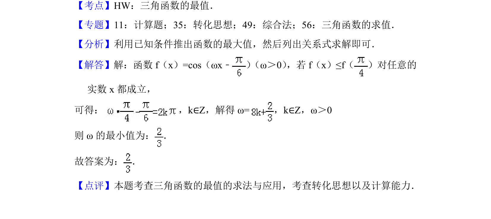

## 题面

## 摘要

由三角函数恒成立条件求ω的最小值，涉及余弦函数最大值与参数计算

## 关联考点

- [[615-三角函数的最值|三角函数的最值]]
- [[450-恒成立问题|恒成立问题]]
- [[725-参数求解|参数求解]]
- [[1125-转化思想|转化思想]]

## 答案与解析

> 📄 原 PDF 第 8 页：`素材/真题/北京/2008-2024·（北京）数学高考真题/2018年高考数学试卷（理）（北京）（解析卷）.pdf`
