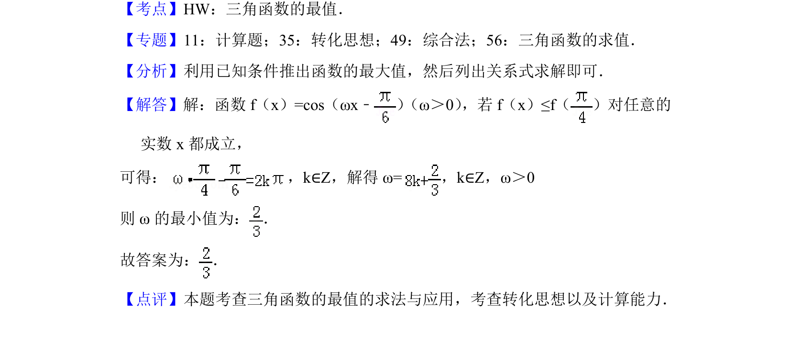

## 题面

## 摘要

由三角函数恒成立条件求ω的最小值，涉及余弦函数最大值与参数计算

## 关联考点

- [[615-三角函数的最值|三角函数的最值]]
- [[450-恒成立问题|恒成立问题]]
- [[725-参数求解|参数求解]]
- [[1125-转化思想|转化思想]]

## 答案与解析

> 📄 原 PDF 第 8 页：`素材/真题/北京/2008-2024·（北京）数学高考真题/2018年高考数学试卷（理）（北京）（解析卷）.pdf`

<!-- 题干文本-start -->
## 题干文本
11． （5分）设函数f（x）=cos（ωx﹣） （ω＞0） ，若f（x）≤f（ ）对任意
的实数x都成立，则ω的最小值为　 　．
<!-- 题干文本-end -->

<!-- 解析文本-start -->
## 解析文本
【考点】HW：三角函数的最值．菁优网版权所有
【专题】11：计算题；35：转化思想；49：综合法；56：三角函数的求值．
【分析】利用已知条件推出函数的最大值，然后列出关系式求解即可．
【解答】解：函数f（x）=cos（ωx﹣） （ω＞0） ，若f（x）≤f（ ）对任意的
实数x都成立，
可得： ，k∈Z，解得ω=，k∈Z，ω＞0
则ω的最小值为： ．
故答案为： ．
【点评】本题考查三角函数的最值的求法与应用，考查转化思想以及计算能力．
<!-- 解析文本-end -->
