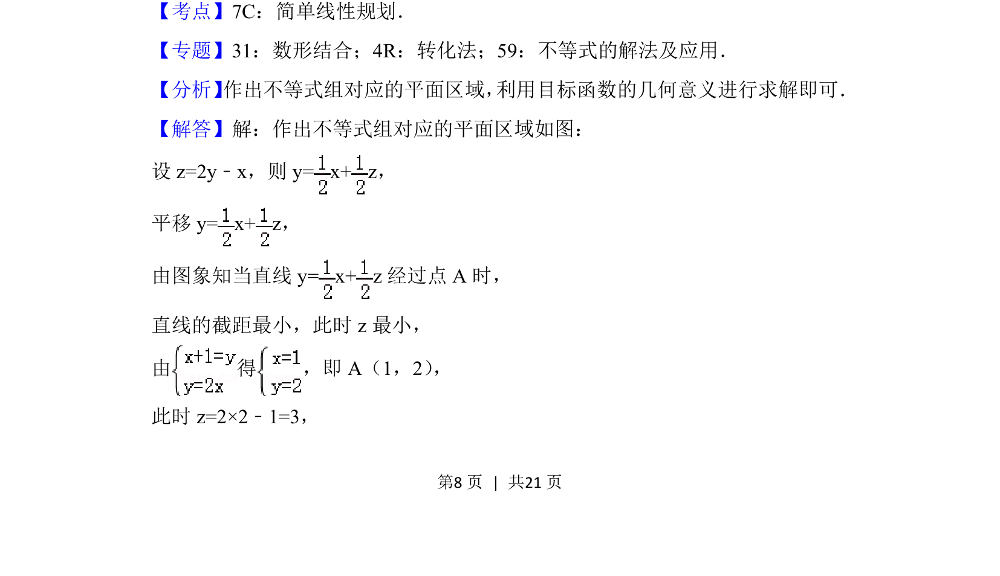
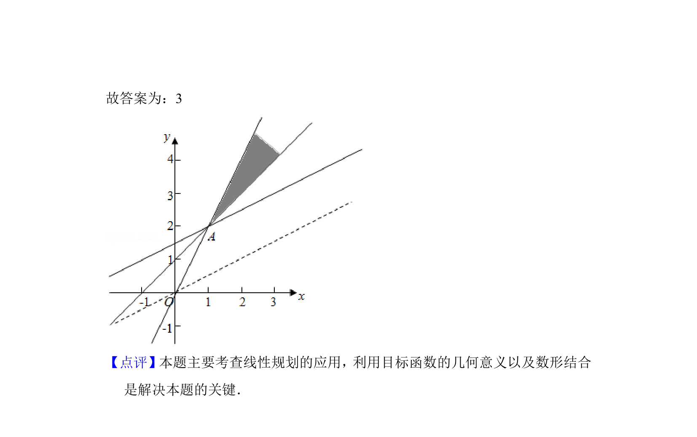

## 题面

## 摘要

作出不等式组表示的可行域，利用目标函数的几何意义求最小值。

## 关联考点

- [[1075-简单线性规划|线性规划]]
- [[1157-可行域|可行域]]
- [[1001-目标函数最值|目标函数最值]]
- [[898-数形结合|数形结合]]

## 答案与解析

> 📄 原 PDF 第 8 页：`素材/真题/北京/2008-2024·（北京）数学高考真题/2018年高考数学试卷（理）（北京）（解析卷）.pdf`
