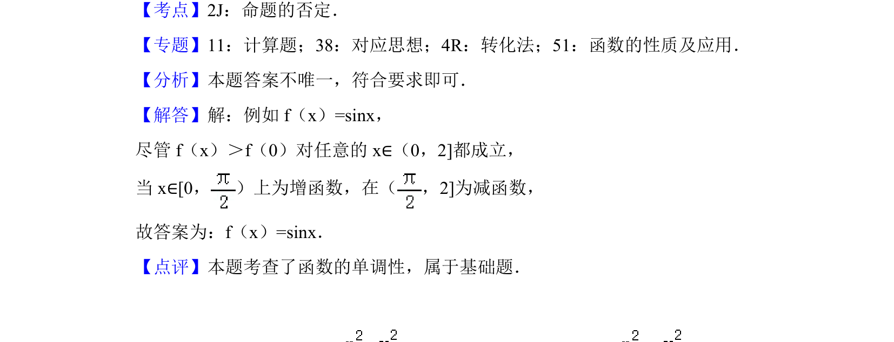

## 题面

## 摘要

该题通过构造反例考查函数单调性定义的理解与命题真假的判断。

## 关联考点

- [[762-命题的否定|命题的否定]]
- [[282-函数的单调性|函数的单调性]]

## 答案与解析

> 📄 原 PDF 第 9 页：`素材/真题/北京/2008-2024·（北京）数学高考真题/2018年高考数学试卷（理）（北京）（解析卷）.pdf`

<!-- 题干文本-start -->
## 题干文本
13． （5分）能说明“若f（x）＞f（0）对任意的x∈（0，2]都成立，则f（x）在
[0，2]上是增函数”为假命题的一个函数是　f（x）=sinx　．
<!-- 题干文本-end -->

<!-- 解析文本-start -->
## 解析文本
【考点】2J：命题的否定．菁优网版权所有
【专题】11：计算题；38：对应思想；4R：转化法；51：函数的性质及应用．
【分析】本题答案不唯一，符合要求即可．
【解答】解：例如f（x）=sinx，
尽管f（x）＞f（0）对任意的x∈（0，2]都成立，
当x∈[0， ）上为增函数，在（ ，2]为减函数，
故答案为：f（x）=sinx．
【点评】本题考查了函数的单调性，属于基础题．
<!-- 解析文本-end -->
