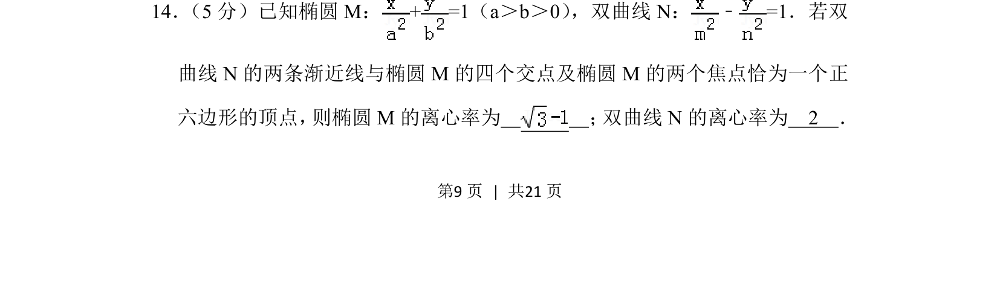
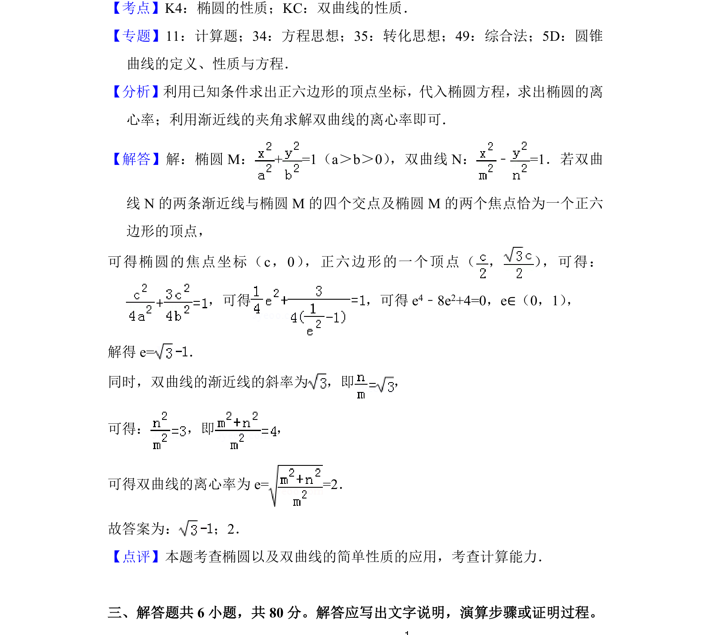

## 题面

## 摘要

椭圆与双曲线结合正六边形几何性质，通过交点与焦点关系求解两者的离心率。

## 关联考点

- [[1243-椭圆的离心率|椭圆的离心率]]
- [[736-双曲线的离心率|双曲线的离心率]]
- [[369-双曲线渐近线|渐近线]]
- [[正六边形]]

## 答案与解析

> 📄 原 PDF 第 9 页：`素材/真题/北京/2008-2024·（北京）数学高考真题/2018年高考数学试卷（理）（北京）（解析卷）.pdf`
