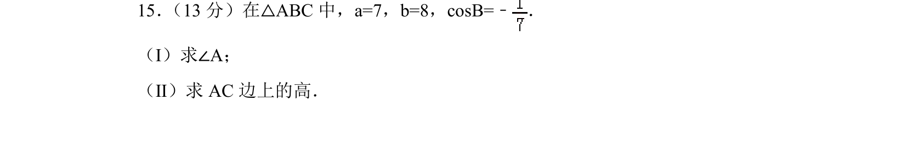
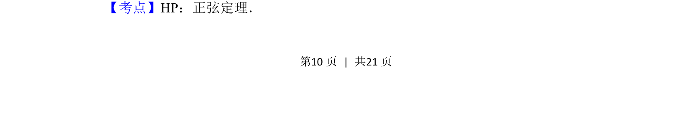
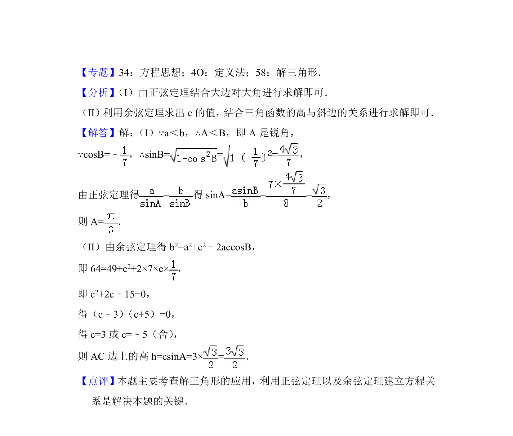

## 题面

## 摘要

已知三角形两边和一角余弦，求另一角及边上的高，考查正弦定理解三角形。

## 关联考点

- [[126-定理|正弦定理]]
- [[589-解三角形|解三角形]]
- [[高的计算]]

## 答案与解析

> 📄 原 PDF 第 10 页：`素材/真题/北京/2008-2024·（北京）数学高考真题/2018年高考数学试卷（理）（北京）（解析卷）.pdf`
