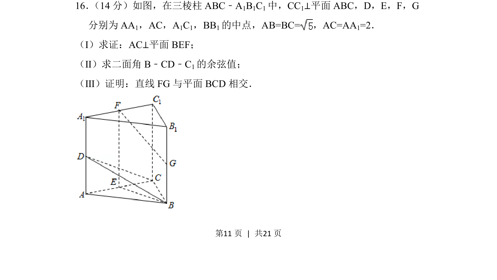
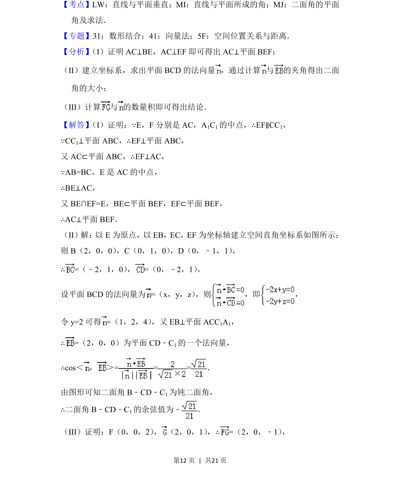
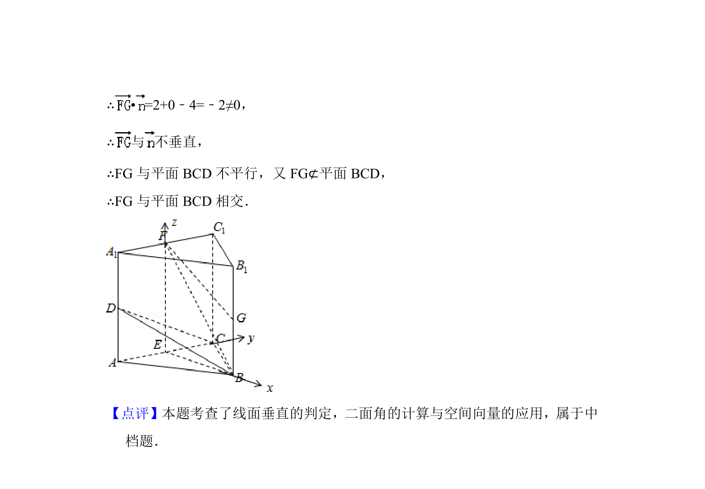

## 题面

## 摘要

三棱柱中证明线面垂直、求二面角余弦值及证明直线与平面相交。

## 关联考点

- [[1085-线面垂直的判定|线面垂直的判定]]
- [[二面角的计算]]
- [[线面位置关系]]

## 答案与解析

> 📄 原 PDF 第 11 页：`素材/真题/北京/2008-2024·（北京）数学高考真题/2018年高考数学试卷（理）（北京）（解析卷）.pdf`

<!-- 题干文本-start -->
## 题干文本
16． （14分）如图，在三棱柱ABC﹣A1B1C1中，CC1⊥平面ABC，D，E，F，G
分别为AA 1，AC，A1C1，BB1的中点，AB=BC=，AC=AA 1=2．
（Ⅰ）求证：AC⊥平面BEF；
（Ⅱ）求二面角B﹣CD﹣C 1的余弦值；
（Ⅲ）证明：直线FG与平面BCD相交．
<!-- 题干文本-end -->

<!-- 解析文本-start -->
## 解析文本

<!-- 解析文本-end -->
