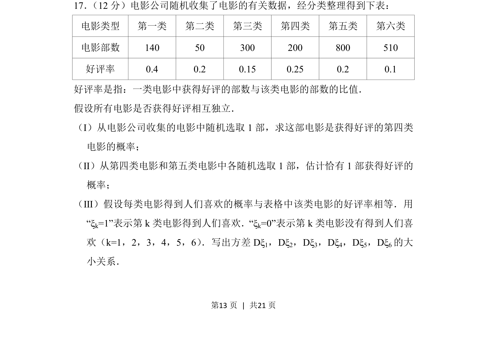
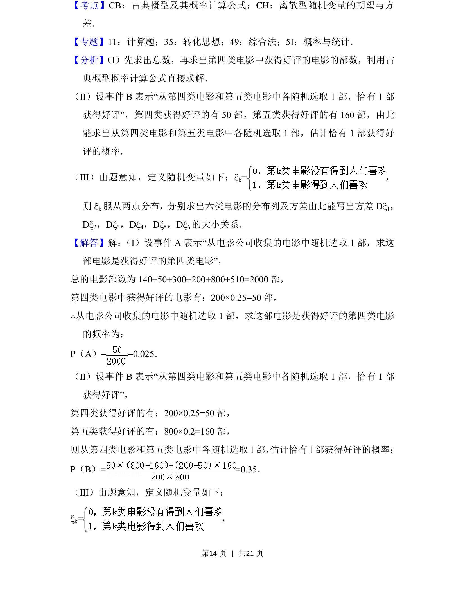
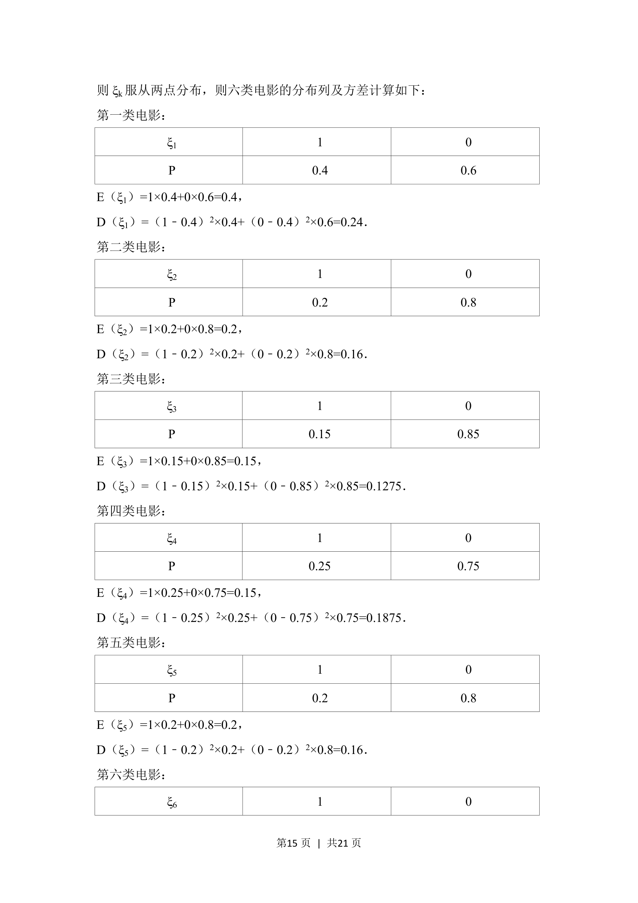
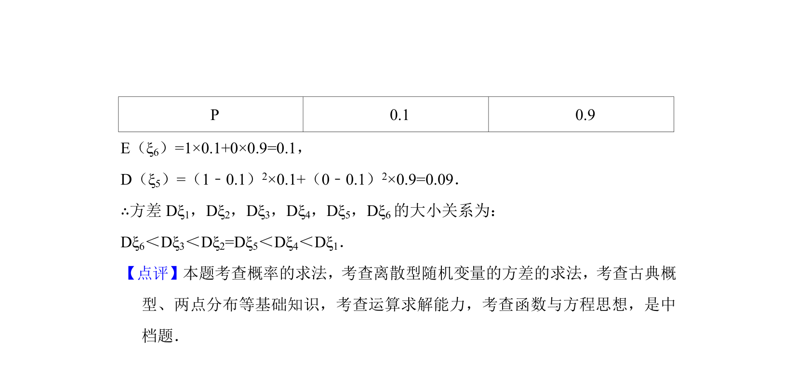

## 题面

## 摘要

该题考查利用频率估计概率、独立事件概率计算及二项分布方差的比较。

## 关联考点

- [[320-古典概型|古典概型]]
- [[468-事件相互独立性-高中|相互独立事件]]
- [[二项分布方差]]
- [[948-概率计算|概率计算]]

## 答案与解析

> 📄 原 PDF 第 13 页：`素材/真题/北京/2008-2024·（北京）数学高考真题/2018年高考数学试卷（理）（北京）（解析卷）.pdf`
