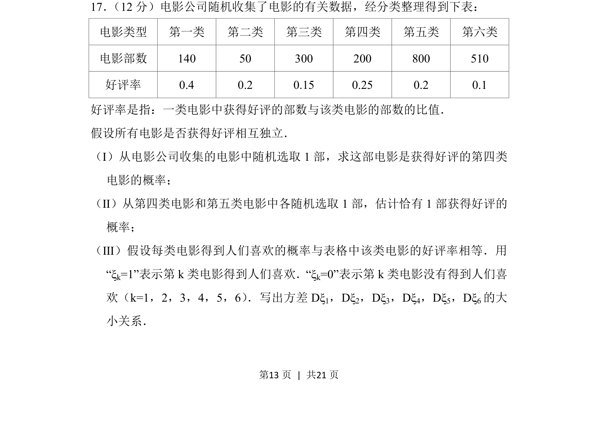
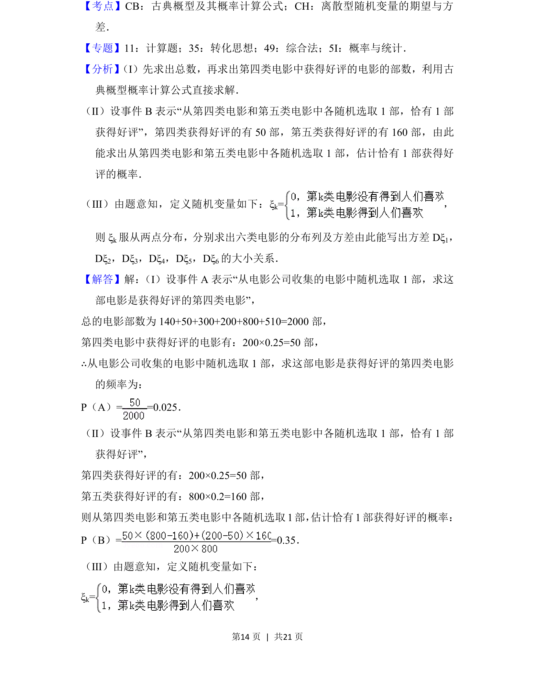
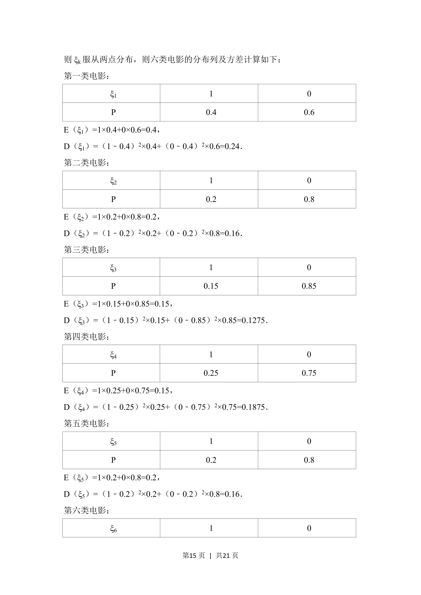
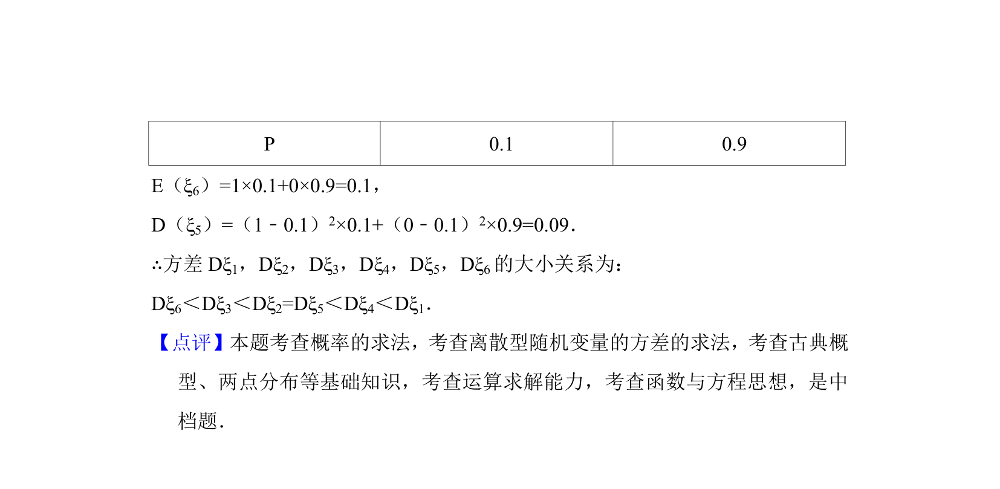

## 题面

## 摘要

该题考查利用频率估计概率、独立事件概率计算及二项分布方差的比较。

## 关联考点

- [[320-古典概型|古典概型]]
- [[468-事件相互独立性-高中|相互独立事件]]
- [[二项分布方差]]
- [[948-概率计算|概率计算]]

## 答案与解析

> 📄 原 PDF 第 13 页：`素材/真题/北京/2008-2024·（北京）数学高考真题/2018年高考数学试卷（理）（北京）（解析卷）.pdf`

<!-- 题干文本-start -->
## 题干文本
17． （12分）电影公司随机收集了电影的有关数据，经分类整理得到下表：
电影类型 第一类 第二类 第三类 第四类 第五类 第六类
电影部数 140 50 300 200 800 510
好评率 0.4 0.2 0.15 0.25 0.2 0.1
好评率是指：一类电影中获得好评的部数与该类电影的部数的比值．
假设所有电影是否获得好评相互独立．
（Ⅰ）从电影公司收集的电影中随机选取1部，求这部电影是获得好评的第四类
电影的概率；
（Ⅱ）从第四类电影和第五类电影中各随机选取1部，估计恰有1部获得好评的
概率；
（Ⅲ）假设每类电影得到人们喜欢的概率与表格中该类电影的好评率相等．用
“ξk=1”表示第k类电影得到人们喜欢．“ξ k=0”表示第k类电影没有得到人们喜
欢（k=1，2，3，4，5，6） ．写出方差Dξ1，Dξ2，Dξ3，Dξ4，Dξ5，Dξ6的大
小关系．
<!-- 题干文本-end -->

<!-- 解析文本-start -->
## 解析文本

<!-- 解析文本-end -->
